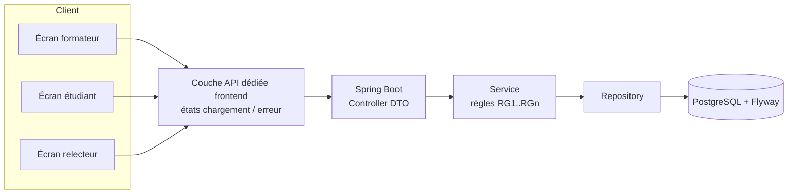

# PLAN D'IMPLÉMENTATION — ÉPREUVE FULLSTACK KFOKAM48

> Document de travail autonome. Un développeur qui n'a jamais vu l'épreuve doit pouvoir l'exécuter tel quel.
> Chaque affirmation est suivie de sa source : `[SUJET]`, `[LISEZ-MOI]`, `[CLIENT]`, `[CONTRAT]`, `[ENVELOPPE]`, `[MODÈLES]`.
> **Échéance unique : dépôt de `SOUMISSION.md` sur la plateforme avant 18h00** `[SUJET §AVANT DE COMMENCER]`.

---

## 0. Préambule documentaire

| Document | Rôle | Points clés extraits |
| --- | --- | --- |
| `LISEZ-MOI_CANDIDAT_KFOKAM48.pdf` (2 p.) | Instructions candidat, à lire en premier | Contenu du dossier `EPREUVE/` · vérif préalable `git` 2.x / `java` 17+ / `node` 18+ · création du dépôt public `kfokam48-epreuve-<matricule>` · test de push · **« l'enveloppe de l'étape 3 n'est pas dans le dossier, elle est remise par le surveillant une fois `[JALON] v0.1` poussé »** · le commit de test de connexion **n'est pas un jalon** (`chore: verification du depot`) · 5 points de vigilance (dépôt = copie d'examen, analyse d'abord, IA libre, pousser au fil de l'eau, 18h00) |
| `EPREUVE_FINALE_KFOKAM48_SUJET.pdf` (8 p.) | Sujet principal — **variante A** | **5 étapes** (étape 5 = soumettre) · barème **Git 30 / Produit 17** · un seul dépôt · pas d'épreuve Git annexe · besoin en 5 points · 6 sections de règles du jeu · contraintes B1–B6, F1–F3 · barème détaillé et malus · Annexes A (16 questions), B (contrat), C (modèles) |
| `assets/EPREUVE_KFOKAM48/` (fichier sans extension = **dossier**) | Dossier d'épreuve complet — **variante B** | `SUJET.pdf` + `SUJET.md` (**6 étapes**, étape 5 = épreuve Git), `CLIENT.md` (16 questions), `api/contrat.yaml` (contrat OpenAPI complet), `LISEZ-MOI.md`, `ENVELLOPE.md`, `modeles/` (`CAHIER_DES_CHARGES.md`, `JOURNAL.md`, `SOUMISSION.md`) |
| `ENVELOPPE_etape3_KFOKAM48.pdf` (2 p.) | Contenu de l'étape 3, remis après `[JALON] v0.1` | **Bug** : deux présences quasi simultanées, une seule enregistrée → issue avant de coder, test qui échoue, branche dédiée, test vert · **Changement de besoin** : **2 relecteurs par exercice, note = moyenne des deux, note d'un seul relecteur = « provisoire »** · touche base + contrat + frontend · analyse à mettre à jour, **nouvelle** migration (jamais modifier la existante), re-priorisation écrite, correctif et évolution séparés (2 branches, 2 PR) · **10 points** |
| `assets/PLAN_EPREUVE.md` (avant réécriture) | Plan existant, à adapter | Couvrait la variante B (6 étapes) · barèmes, malus, jalons, contradictions `Q10/Q15`, trous du `CLIENT.md`, RG1–RG15 · **incomplet** sur la comparaison des deux variantes du sujet, sur l'enveloppe (contenu réel non intégré), sur l'architecture cible et sur les estimations de durée |

### ⚠️ Anomalie documentaire majeure — deux versions du sujet

Les documents fournissent **deux variantes du même épreuve**, non réconciliables :

| Point | Variante A — PDF racine | Variante B — `EPREUVE_KFOKAM48/` |
| --- | --- | --- |
| Nombre d'étapes | **5** (étape 5 = soumettre) `[SUJET-A §2]` | **6** (étape 5 = épreuve Git, étape 6 = soumettre) `[SUJET-B §2]` |
| Épreuve Git annexe | **absente** | **présente** : `git-lab.bundle`, 2e dépôt public `kfokam48-gitlab-<matricule>`, 17 pts `[SUJET-B §Étape 5]` |
| Barème Git | **30 pts** | **32 pts** (dont 17 pour l'épreuve Git) |
| Barème Produit | **17 pts** | **15 pts** |
| Dossier | `l'enveloppe` remise par le surveillant | `enveloppe` = script + `git-lab.bundle` |
| Commit de test de push | `chore: verification du depot` `[LISEZ-MOI §2d]` | `[JALON] depart` `[LISEZ-MOI.md §2.4]` |

Les deux barèmes somment à 100. `LISEZ-MOI_CANDIDAT…pdf` affirme que « SUJET.pdf et SUJET.md — même contenu, deux formats » : **c'est faux**, les deux sujets diffèrent structurellement.

**Décision de plan (validée) :** on planifie sur la **variante A, c'est-à-dire les trois PDF à la racine de `assets/`** — `LISEZ-MOI_CANDIDAT_KFOKAM48.pdf`, `EPREUVE_FINALE_KFOKAM48_SUJET.pdf`, `ENVELOPPE_etape3_KFOKAM48.pdf`.

*Raison :* ce sont les documents « remis au candidat » dans le dossier d'instructions ; `LISEZ-MOI_CANDIDAT…pdf` décrit exactement ce qu'il y a dans ce dossier et ne mentionne **ni `git-lab.bundle` ni second dépôt**.

*Conséquences de ce choix :* **5 étapes** (étape 5 = soumettre), **un seul dépôt public**, barème **Git 30 / Produit 17**, enveloppe remise par le surveillant sur demande, commit de test de connexion `chore: verification du depot`.

*Repli :* si un `git-lab.bundle` vous est remis pendant l'épreuve, c'est que la variante B est en vigueur → suivre alors §3 « étape 5 » de la variante B (épreuve Git, 17 pts, 2e dépôt public) et le barème B. Le repli est décrit en §3 et §6.4 ; il ne coûte aucune refonte, seulement 20 minutes de plus.

---

## 1. Compréhension du sujet

### 1.1 Objectif global

Livrer une application de **présence et de relecture par les pairs** pour la formation KFOKAM48, **et surtout** démontrer une démarche complète : analyser un besoin flou et contradictoire, le spécifier, le découper en tickets, livrer par jalons, encaisser un changement de besoin en cours de route — le tout **lisible dans l'historique Git** `[SUJET §AVANT DE COMMENCER, §6 CONSEIL]`.

> « Ton dépôt est ta copie d'examen : le correcteur lira ton historique comme on lit une rédaction. » `[SUJET]`
> « L'application entière ne pèse que 15 points » (variante B) / « 17 points » (variante A) `[SUJET §6]`.

### 1.2 Périmètre fonctionnel (les 5 besoins) `[SUJET §1 LE BESOIN]`

1. Un formateur ouvre une session de cours et obtient un **code de présence**.
2. Un étudiant saisit ce code pour **marquer sa présence**.
3. Un étudiant **dépose le lien** de son exercice pour une session.
4. Un étudiant est assigné à la **relecture** de l'exercice d'un pair : note et commentaire.
5. Le formateur voit un **tableau** : présence et moyenne des notes par étudiant.

La demande est **incomplète et se contredit par endroits** : deux réponses du `CLIENT.md` se contredisent, et il reste « un trou que personne n'a vu ». Le candidat doit trancher et **écrire** ses décisions `[SUJET §1]`.

**Évolution imposée à l'étape 3** `[ENVELOPPE §2]` : chaque exercice est relu par **deux** pairs, note retenue = **moyenne des deux** ; si un seul a rendu, sa note s'affiche **en attendant, marquée comme provisoire**.

### 1.3 Technologies imposées

| Domaine | Contrainte | Source |
| --- | --- | --- |
| Backend | **Java 17+ / Spring Boot / Maven**, wrapper `mvnw` **commité** (B1) | `[SUJET §3 B1]` |
| Contrat | `api/contrat.yaml` respecté **à la lettre** : chemins, verbes, codes HTTP, format d'erreur (B2) | `[SUJET §3 B2]`, `[CONTRAT]` |
| Archi backend | couches contrôleur/service/repository, DTO, jamais d'entité JPA en JSON (B3) | `[SUJET §3 B3]` |
| Robustesse | validation d'entrées + `@RestControllerAdvice`, jamais de stack trace client (B4) | `[SUJET §3 B4]` |
| Schéma | **Flyway ou Liquibase**, migrations commitées, `ddl-auto=update` interdit hors tests (B5) | `[SUJET §3 B5]` |
| Tests | 1 unitaire (règle métier réelle) + 1 intégration (endpoint), sur poste vierge (B6) | `[SUJET §3 B6]` |
| Frontend | **React \| Angular \| Next.js** au choix, justifié en 1 ligne dans le README, build qui passe (F1) | `[SUJET §3 F1]` |
| Écrans | 3 écrans : formateur, étudiant, relecteur (F2) | `[SUJET §3 F2]` |
| Front propre | couche d'appels API dédiée, états chargement/erreur, **aucune règle métier dupliquée** (F3) | `[SUJET §3 F3]` |
| Démarrage | `docker compose up` **ou 3 commandes max**, testées depuis un clone vierge, **+ données de démonstration** | `[SUJET §3 Démarrage]` |
| Langages docs | Markdown + **Mermaid/PlantUML texte** (aucun PNG) | `[SUJET §2b]` |

**Hors contrainte, à décider et écrire :** base de données (H2/PostgreSQL…), front exact, hébergement. ⚠️ **Information non trouvée dans les documents fournis** : aucune base de données ni hébergement n'est imposé.

### 1.4 Livrables attendus

| # | Livrable | Où | Source |
| --- | --- | --- | --- |
| L1 | `docs/CAHIER_DES_CHARGES.md` — 10 sections imposées, dans l'ordre | dépôt projet | `[SUJET §2a]` |
| L2 | 3 diagrammes Mermaid/PlantUML texte : **D1** cas d'utilisation, **D2** classes/modèle (cohérent avec les migrations), **D3** séquence « marquer sa présence » nominal + **code expiré** + **déjà présent** (cohérent avec les codes HTTP) — **+D4** états-transitions = bonus +3 | `docs/diagrammes/` | `[SUJET §2b]` |
| L3 | Backlog en **issues GitHub** : titre = un résultat, critères « quand… alors… », priorité Must/Should/Could, renvoi `EFx`/`RGx`, ≈10 issues | onglet Issues | `[SUJET §2c]` |
| L4 | `api/contrat.yaml` complété **et figé avant le premier commit de code** (5 pts) | `api/` | `[SUJET §2d]` |
| L5 | 3 commits vides `[JALON] analyse`, `[JALON] v0.1`, `[JALON] v1.0` **dans cet ordre et poussés** | historique | `[SUJET §2]` |
| L6 | Code backend Spring Boot conforme B1–B6 | `backend/` | `[SUJET §3]` |
| L7 | Frontend 3 écrans conforme F1–F3 | `frontend/` | `[SUJET §3]` |
| L8 | Après l'étape 3 : analyse **mise à jour** (3 pts), nouvelle migration, contrat mis à jour, sacrifice de périmètre **écrit** | dépôt | `[ENVELOPPE]` |
| L9 | Étape 4 : `CHANGELOG.md` cohérent, `README` testé depuis un clone vierge, backlog trié | racine | `[SUJET §2 étape 4]` |
| L10 | `docs/JOURNAL.md` : **une entrée par étape**, écrite au moment où l'étape se termine | `docs/` | `[SUJET §4 Journal]` |
| L11 | `SOUMISSION.md` téléversé sur la plateforme **avant 18h00** — sans lui, rien n'est rendu | plateforme | `[SUJET §2 étape 5]`, `[LISEZ-MOI §4]` |
| L12 | *Variante B uniquement* : 2e dépôt public `kfokam48-gitlab-<matricule>` avec toutes les branches poussées | GitHub | `[SUJET-B §Étape 5]` — **non retenu** (§0) |

### 1.5 Critères d'évaluation (barème sur 100)

| Bloc | **Variante A (retenue)** | Variante B (repli) | Détail |
| --- | ---: | ---: | --- |
| Analyse & conception | **38** | 38 | Cahier des charges 10 · 3 diagrammes 12 · Backlog 8 · Contrat figé avant le code 5 · Analyse mise à jour après étape 3 : 3 · *bonus D4 : +3* |
| Conduite du changement (étape 3) | **10** | 10 | Issue avant de coder, bug reproduit, migration versionnée, contrat mis à jour, re-priorisation écrite, correctif/évolution séparés `[ENVELOPPE]` |
| Git | **30** | *32* | **A** : commits atomiques/messages explicites 8 · branche par issue + PR liée 7 · 3 jalons 5 · `.gitignore` avant le code 5 · main sain + aucun secret 5. *B : épreuve `git-lab` 17 + hygiène 15* |
| Produit & conformité | **17** | *15* | **A** : contrat + codes HTTP 7 · B3–B6 / F1–F3 7 · démarre chez un tiers avec données de démo 3. *B : 6 / 6 / 3* |
| Journal | **5** | 5 | Une entrée **par étape**, écrite en temps réel |
| **Total** | **100** | **100** | |

**Malus** `[SUJET §4 Malus]` : secret ou `target/`·`node_modules/`·`dist/` commités **−5** · aucune issue de la journée **−10** · un seul commit ou historique concentré sur la dernière heure **−10** · `[JALON] analyse` manquant ou après le premier commit de code **−5** · `push --force` destructeur sur `main` du projet **−5** · dépôt privé / lien mort / hash invalide = **partie non corrigée**.

---

## 2. Architecture technique

### 2.1 Stack

- **Frontend : React (Vite + TypeScript)** — recommandé. *Justification 1 ligne à mettre dans le README (F1)* : « React choisi pour son écosystème et la vitesse de mise en place d'une SPA à 3 écrans ; aucun rendu côté serveur n'est exigé. » Angular et Next.js restent acceptés `[SUJET §3 F1]`.
- **Backend : Java 21 / Spring Boot 3 / Maven**, wrapper `mvnw` commité `[SUJET §3 B1]`.
- **Persistance : PostgreSQL + Flyway** en production/ démo, **H2 en mémoire pour les tests** (poste vierge, B5/B6). Base non imposée par le sujet ⚠️ (hypothèse à écrire dans la section 8 du cahier des charges).
- **Conteneurisation : `docker compose up`** (backend + base + front statique), alternative : 3 commandes max dans le README `[SUJET §3 Démarrage]`.

### 2.2 Arborescence cible (structure imposée `[SUJET §Ton dépôt]`)

```
kfokam48-epreuve-<matricule>/
├── .gitignore                  # Java + JS, posé AVANT le premier commit de code
├── README.md                   # install, démarrage, choix du front justifié (F1)
├── CHANGELOG.md                # étape 4
├── docs/
│   ├── CAHIER_DES_CHARGES.md   # 10 sections
│   ├── JOURNAL.md              # 1 entrée par étape
│   └── diagrammes/             # D1-D4 en Mermaid
│       ├── D1-cas-d-utilisation.md
│       ├── D2-modele-de-donnees.md
│       ├── D3-sequence-presence.md
│       └── D4-etats-exercice.md   # bonus
├── api/
│   └── contrat.yaml            # figé avant le 1er commit de code
├── backend/                    # Spring Boot (Java 17+, Maven, mvnw)
│   ├── pom.xml · mvnw · mvnw.cmd
│   └── src/main/java/.../{controller,service,repository,dto,config,exception}
│       └── src/main/resources/{application.yml, db/migration/V*.sql}
│       └── src/test/java/...   # 1 unitaire + 1 intégration mini (B6)
└── frontend/                   # React | Angular | Next.js
    └── src/{api/, screens/, components/, state/}
```

### 2.3 Schéma d'architecture (Mermaid)



*Contraintes respectées :* aucune requête base dans un contrôleur, aucune entité JPA exposée (DTO), erreurs centralisées par `@RestControllerAdvice` renvoyant `{code,message}` `[SUJET §3 B3/B4]`, moyenne calculée **côté API** uniquement `[SUJET §3 F3]`.

### 2.4 Modèle de données minimal (à aligner sur D2 et les migrations)

`Promotion` 1—N `Etudiant` · `Session` (titre, promotionId, ouvertureAt, expirationAt, code, statut OUVERTE/CLOTUREE) · `Presence` (session, etudiant, source `ETUDIANT|FORMATEUR`, UNIQUE(session, etudiant)) · `Exercice` (session, etudiant, lien, statut `DEPOSE|EN_ATTENTE|RELU`) · `Relecture` (exercice, relecteur, note 0–20, commentaire, statut `EN_ATTENTE|RENDUE|PROVISOIRE`) — la cardinalité passe de **1 à 2 relecteurs** à l'étape 3 `[CLIENT Q6]` → `[ENVELOPPE §2]`.

---

## 3. Plan d'implémentation étape par étape

> **Ordre imposé par le sujet** : les 5 étapes se suivent **dans l'ordre**, et l'ordre se lit dans l'historique Git `[SUJET §2]`.
> **Règle absolue : aucun code avant le commit `[JALON] analyse`.** `[SUJET §2 étape 1]`, `[LISEZ-MOI §3.2]`

### Étape 0 — Mise en place du dépôt (prérequis)

- **Objectif** : avoir un dépôt conforme, public, poussable, avant toute analyse.
- **Tâches détaillées** :
  1. `git --version` (2.x), `java -version` (17+), `node --version` (18+) — sinon prévenir le surveillant `[LISEZ-MOI §2a]`.
  2. Créer le dépôt GitHub **public** `kfokam48-epreuve-<matricule>` `[LISEZ-MOI §2c]`.
  3. Vérifier le push : `git commit --allow-empty -m "chore: verification du depot" && git push` (ce commit **n'est pas** un jalon, ne jamais utiliser le préfixe `[JALON]` ailleurs) `[LISEZ-MOI §2d]`.
  4. Écrire un vrai `.gitignore` **Java + JS** (`.gitignore` actuel = `/assets` seulement → **non conforme**, voir §4.1) **avant le premier commit de code** `[SUJET §4 Git 5 pts]`.
  5. Créer l'arborescence `docs/ docs/diagrammes/ api/`, y copier `contrat.yaml` et les 3 modèles depuis `assets/EPREUVE_KFOKAM48/`.
- **Livrable** : dépôt public conforme, arborescence vide initialisée, premier commit de structure.
- **Validation** : `git clone` de test dans `/tmp` + `git push` accepté ; `.gitignore` contient bien `target/`, `node_modules/`, `dist/`, `.env`.
- **Estimation** : 20 min.

### Étape 1 — Analyser, spécifier, concevoir — **38 pts, aucun code**

- **Objectif** : produire les 4 livrables d'analyse puis poser `[JALON] analyse`.
- **Tâches détaillées** :
  1. **`docs/CAHIER_DES_CHARGES.md`** — 10 sections dans l'ordre imposé `[SUJET §2a]` :
     1. Contexte et objectif · 2. Acteurs et rôles · 3. Périmètre (**inclus et explicitement exclus**) · 4. Exigences fonctionnelles `EF1…` avec critère « quand… alors… » + priorité · 5. Exigences non fonctionnelles (volumétrie, mobile, temps de réponse) · 6. Règles de gestion `RG1…` **avec source `Qx`** · 7. Zones d'ombre, hypothèses et **contradictions tranchées** · 8. Contraintes techniques (B1–B6, F1–F3) · 9. Livrables · 10. Démarche prévue + **Definition of Done**.
  2. **3 diagrammes Mermaid** dans `docs/diagrammes/` (D1 cas d'utilisation, D2 classes/cardinalités **cohérent avec les migrations**, D3 séquence présence nominal + **410 CODE_EXPIRE** + **409 DEJA_PRESENT** **cohérent avec le contrat**) + **D4 bonus** états-transitions de l'exercice `[SUJET §2b]`.
  3. **Backlog en issues** : ≈10 issues, titre = résultat utilisateur, critères « quand… alors… », priorité Must/Should/Could, renvoi `EFx`/`RGx`, estimation `[SUJET §2c]`.
  4. **`api/contrat.yaml` complété** : les 5 opérations imposées **plus** celles nécessaires — à minima : ouverture/clôture de session (trou du `CLIENT.md`, §6.2), liste des sessions, création d'une relecture « en attente » (**nécessaire** : `POST /api/relectures/{id}` opère sur une relecture déjà existante), présence ajoutée par le formateur (Q14), gestion des tentatives échouées (Q4, `429`), tableau de l'étudiant (Q8/Q16) `[CONTRAT]`, `[SUJET §2d]`.
  5. **Trancher les contradictions et trous** (§6) dans la section 7 du cahier des charges, en citant `Qx`.
  6. Entrée « Étape 1 » du `JOURNAL.md` (Fait / Bloqué / IA) `[SUJET §4 Journal]`.
  7. `git add` + commit des docs, puis **`git commit --allow-empty -m "[JALON] analyse"` + `git push`** `[SUJET §2]`.
- **Livrable** : cahier des charges complet, 4 diagrammes, ≈10 issues, contrat figé, jalon d'analyse poussé.
- **Validation** : le commit `[JALON] analyse` existe **avant** tout commit contenant du code (ordre dans l'historique = ce qui est noté) ; chaque `EFx`/`RGx` cité existe ; D2 correspond ligne à ligne aux migrations ; D3 correspond aux codes du contrat.
- **Estimation** : 3 h à 3 h 30.

### Étape 2 — Construire la première version (stories **Must** uniquement)

- **Objectif** : un incrément fonctionnel et démontrable, derrière une discipline Git irréprochable.
- **Tâches détaillées** :
  1. `spring init` / création du projet Maven **maintenant autorisé** ; committer `mvnw` + `.gitattributes` (B1).
  2. Flyway dès la première table : `V1__init.sql` **avant** toute donnée (B5) — « la plupart de ceux qui souffriront à l'étape 3 souffriront pour une seule raison : un schéma de base non versionné » `[SUJET §6]`.
  3. Implémenter les 5 opérations du contrat à la lettre (B2), en couche Controller → Service → Repository, DTO obligatoires (B3), validation + `@RestControllerAdvice` centralisé renvoyant `{code,message}` (B4).
  4. Tests : 1 unitaire sur une règle réelle (ex. expiration 15 min = RG1) + 1 intégration sur un endpoint (B6).
  5. Frontend : 3 écrans (F2), couche d'appels API unique (F3), états chargement/erreur, moyenne **jamais recalculée** côté client (F3).
  6. Données de démonstration chargées au démarrage (une promotion, ~8 étudiants, 2 sessions, quelques exercices) `[SUJET §3 Démarrage]`.
  7. **Une branche par issue**, une **PR par branche**, commit fermant l'issue : `git commit -m "Enregistrement d'une présence par code (RG1) — Closes #4"` `[SUJET §2c]`.
  8. Pousser **au fil de l'eau** ; entrée « Étape 2 » du journal.
  9. **`git commit --allow-empty -m "[JALON] v0.1"` + push** `[SUJET §2]`.
- **Livrable** : v0.1 démontrable, issues Must fermées, jalon poussé.
- **Validation** : `docker compose up` (ou 3 commandes) depuis un clone vierge ouvre une app **avec données de démo** ; `./mvnw test` vert sur poste vierge ; le build front passe ; aucune issue ouverte sans PR.
- **Estimation** : 4 h à 5 h.

### Étape 3 — Ouvrir l'enveloppe — **10 pts de conduite du changement**

- **Objectif** : encaisser le bug + le changement de besoin **à la méthode**, ce qui est ce qui est noté.
- **Tâches détaillées** (dans cet ordre, l'ordre se lit dans l'historique) :
  1. **Demander l'enveloppe au surveillant** en lui donnant l'adresse du dépôt — elle n'est remise qu'une fois `[JALON] v0.1` poussé `[SUJET §2 étape 3]`, `[LISEZ-MOI §1]`. *(Repli variante B : `./enveloppe`, script qui refuse de s'ouvrir tant que le jalon n'est pas poussé.)*
  2. **Bug — présences simultanées perdues** `[ENVELOPPE §1]` :
     - ouvrir une **issue** décrivant le problème **et la façon de le reproduire** *avant* de toucher au code ;
     - écrire un **test qui échoue** (deux `POST /api/presences` concurrents, une seule présence) ;
     - corriger dans une **branche dédiée**, commit référençant l'issue (cause probable : contrainte d'unicité non gérée / read-then-write non atomique → contrainte DB `UNIQUE(session, etudiant)` + gestion du `DataIntegrityViolationException` → `409`) ;
     - re-vérifier le test au vert.
  3. **Changement de besoin — 2 relecteurs, moyenne, note provisoire** `[ENVELOPPE §2]` :
     - **mettre à jour l'analyse** (cdd : RG issue de `Q6`, exigences, section 7 + diagrammes devenus faux) **dans un commit qui le dit** (3 pts) ;
     - mettre à jour `api/contrat.yaml` si la forme des réponses change ;
     - **nouvelle migration `V2__…sql`**, jamais modifier `V1`, la base remplie doit survivre ;
     - découper en **issues** et **re-prioriser** : ce Must tardif fait sortir quelque chose du périmètre → **écrire le sacrifice** dans le journal ou le cahier des charges ;
     - **2 branches, 2 PR** : correctif et évolution ne mélangent jamais un commit.
- **Livrable** : issue + test rouge + fix d'un côté, migration V2 + analyse mise à jour + contrat mis à jour + sacrifice écrit de l'autre.
- **Validation** : la chronologie Git prouve que l'issue précède le premier commit de correction ; la migration `V1` est inchangée dans le diff ; les 2 PR sont distinctes ; les 6 lignes du tableau de l'enveloppe sont cochables.
- **Estimation** : 1 h 30 à 2 h.

### Étape 4 — Livrer la version finale

- **Objectif** : un état livrable, traçable et vérifiable par un tiers.
- **Tâches détaillées** :
  1. **`git commit --allow-empty -m "[JALON] v1.0"`** + push.
  2. `CHANGELOG.md` **cohérent avec l'historique réel** (aucun élément absent de l'historique).
  3. `README` d'installation **testé depuis un clone vierge dans un dossier vide** : installation, démarrage (3 commandes max), choix du front justifié en 1 ligne (F1), données de démo.
  4. Backlog restant trié (issues fermées/ouvertes avec priorité à jour).
  5. Mise à jour finale du `JOURNAL.md`.
- **Livrable** : release v1.0, changelog, README validé.
- **Validation** : dans un dossier vide : `git clone … && <commande 1> && <commande 2> && <commande 3>` → application opérationnelle **avec données de démonstration**.
- **Estimation** : 45 min.

### Étape 5 — Soumettre — **sans elle, rien n'est rendu**

- **Objectif** : rendre effectivement le travail.
- **Tâches détaillées** :
  1. Remplir `SOUMISSION.md` (modèle `modeles/SOUMISSION.md`, **section « Projet » seule en variante A**) : nom, matricule, centre, URL du dépôt, **hash complet 40 caractères**, frontend choisi, commande de démarrage `[SUJET §2 étape 5]`.
  2. Pousser **tout** avant de relever le hash : « la correction porte exactement sur le commit que tu déclares. Tout ce que tu pousses après est ignoré. »
  3. Vérifier l'adresse du dépôt **en fenêtre de navigation privée** ; dépôt **public**, à conserver jusqu'à la publication des résultats.
  4. Téléverser sur la plateforme **bien avant 18h00** (« Ne soumets pas à 17h58 »).
- **Livrable** : `SOUMISSION.md` accepté par la plateforme.
- **Validation** : ouverture du lien en navigation privée, hash de 40 caractères existant sur GitHub, `git status` propre et tout poussé.
- **Estimation** : 20 min (**+ marge de sécurité : viser 17h00**).

### Synthèse des estimations

| Étape | Durée | Réserve |
| --- | ---: | ---: |
| 0 — Mise en place | 20 min | |
| 1 — Analyse (38 pts) | 3 h 30 | **ne pas la comprimer** |
| 2 — v0.1 | 5 h | |
| 3 — Enveloppe (10 pts) | 2 h | |
| 4 — Final | 45 min | |
| 5 — Soumission | 20 min | fin opérationnelle visée **17h00** |
| **Total** | **≈ 11 h 55** | ~1 h de marge |

*Repli variante B (seulement si un `git-lab.bundle` vous est remis) : ajouter l'épreuve Git — 2e dépôt public, 5 situations du README, `git push origin --all` — soit +20 min et +17 pts, entre les étapes 4 et 5.*

⚠️ **Information non trouvée dans les documents fournis** : horaire exact d'ouverture de l'épreuve. Seule l'échéance de 18h00 est donnée `[SUJET]`.

---

## 4. Gestion du dépôt Git

### 4.1 État actuel du dépôt et écarts à corriger **avant** tout code

| Constat | Vérification | Action |
| --- | --- | --- |
| Remote `https://github.com/Brahimi-Talla01/kfokam48-epreuve-257.git` | `git remote -v` | ⚠️ Le nom imposé est `kfokam48-epreuve-<matricule>` avec un matricule type `KF48-YAO-042` `[LISEZ-MOI §2c]`. Si `257` n'est pas le matricule complet, **renommer sur GitHub (Settings → Rename)** + `git remote set-url`. |
| Un seul commit `first commit` (README.md seul) | `git log --oneline` | Acceptable tant qu'il n'y a **pas** de code ; le message est faible mais n'entre dans aucun malus tant que l'historique reste lisible. |
| `.gitignore` = **`/assets`** seulement (et non suivi) | `cat .gitignore` | ⚠️ **Non conforme** à « .gitignore Java + JS posé avant le premier commit de code » (5 pts). **Décision appliquée :** on ne garde l'ignore que sur les documents d'épreuve (`/assets/*.pdf`, `/assets/EPREUVE_KFOKAM48/`, `/assets/INIT.md`) et on complète avec les entrées Java + JS (`target/`, `node_modules/`, `dist/`, `.idea/`, `.env`, `*.log`). |
| `assets/` entièrement ignoré donc le plan non versionné | `git check-ignore -v assets/PLAN_EPREUVE.md` | **Résolu** par la ligne ci-dessus : `assets/PLAN_EPREUVE.md` devient suivi. Les documents d'épreuve (PDF, dossier `EPREUVE_KFOKAM48/`) restent hors du dépôt public : la structure imposée n'autorise que `docs/ · api/ · backend/ · frontend/`. *Alternative à retenir plus tard : migrer ce plan vers `docs/PLAN_EPREUVE.md`.* |
| Visibilité du dépôt | à vérifier sur GitHub | **Publique** — un dépôt privé = partie non corrigée `[SUJET §Ton dépôt]`. |

### 4.2 Stratégie de branches

- `main` : toujours sain, toujours poussé, **jamais** de `push --force` destructeur (−5).
- `feature/<slug-issue>` : **une branche par ticket** (`feature/presence-code`, `feature/tableau-formateur`, `fix/presences-simultanees`, `evolution/deux-relecteurs`…).
- `release` non nécessaire ; la PR est l'unité de revue.
- Repli B : si un dépôt `git-lab` est fourni, son historique est réécrit avec `push --force` (attendu) — **jamais** celui du projet.

### 4.3 Convention de commits

- Messages **en français**, impératif, une idée par commit : `Enregistrement d'une présence par code (RG1) — Closes #4` `[SUJET §2c]`.
- Toujours citer la règle/l'exigence (`RG1`, `EF4`) **et/ou** l'issue (`#12`).
- Interdits : `update`, `fix`, `test2` (valent zéro) `[SUJET-A §4 Git]`.
- Trois commits **vides de code**, messages **exacts** :

  ```bash
  git commit --allow-empty -m "[JALON] analyse"   # fin étape 1, AVANT tout code
  git commit --allow-empty -m "[JALON] v0.1"      # fin étape 2, débloque l'enveloppe
  git commit --allow-empty -m "[JALON] v1.0"      # étape 4
  git push
  ```

  « Un jalon non poussé n'existe pas. » `[SUJET §2]`. Ne **jamais** réutiliser le préfixe `[JALON]` pour autre chose `[LISEZ-MOI §2d]`.

### 4.4 Commandes essentielles

```bash
# cycle normal d'un ticket
git checkout -b feature/presence-code
# ... travailler, committer par idées atomiques ...
git commit -m "Enregistrement d'une présence par code (RG1) — Closes #4"
git push -u origin feature/presence-code
gh pr create --fill            # PR liée à l'issue
gh issue close 4               # sinon fermée automatiquement par "Closes #4"

# jalons
git commit --allow-empty -m "[JALON] v0.1" && git push

# vérifications répétées avant chaque push
git status --short
git log --oneline --graph --decorate -15
git grep -nE "target/|node_modules/|dist/" --name-only   # ne rien voir d'instancié
```

### 4.5 Synchronisation avec le remote

- Pousser **après chaque PR merge** et **après chaque entrée de journal** ; jamais tout pousser à la fin (historique concentré sur la dernière heure = −10).
- Vérifier régulièrement que `origin/main` est identique au local : `git fetch && git status`.
- Aucun secret (token, `.env`) **jamais** commité : −5 et partie potentiellement non corrigée.

---

## 5. Checklist finale

**Conformité structure et dépôt**
- [ ] Dépôt **public** `kfokam48-epreuve-<matricule>` (nom exact, matricule complet) — *repli B : 2e dépôt `kfokam48-gitlab-<matricule>`*
- [ ] Structure `docs/ · api/ · backend/ · frontend/` respectée
- [ ] `.gitignore` Java + JS posé **avant** le premier commit de code, aucun fichier généré dans l'historique
- [ ] Aucun secret nulle part dans l'historique
- [ ] `main` toujours sain, aucun `push --force` destructeur

**Analyse (38 pts)**
- [ ] `docs/CAHIER_DES_CHARGES.md` : 10 sections, dans l'ordre, `EFx` et `RGx` numérotés, critères « quand… alors… »
- [ ] Section 7 : contradictions `Q10/Q15` tranchées **et justifiées**, trous identifiés avec décision écrite
- [ ] D1, D2, D3 en Mermaid texte ; **D2 ≡ migrations**, **D3 ≡ codes HTTP du contrat**
- [ ] D4 (bonus) états-transitions de l'exercice
- [ ] ≈10 issues : titre = résultat, critères vérifiables, priorité Must/Should/Could, renvoi `EFx`/`RGx`
- [ ] `api/contrat.yaml` complété **et figé avant le premier commit de code**

**Jalons (3 × malus −5)**
- [ ] `[JALON] analyse` **avant** le premier commit de code, poussé
- [ ] `[JALON] v0.1` poussé (condition d'obtention de l'enveloppe)
- [ ] `[JALON] v1.0` poussé
- [ ] Les trois, **dans cet ordre**

**Étape 3 (10 pts)**
- [ ] Issue ouverte **avant** le premier commit de correction
- [ ] Bug reproduit par un **test qui échoue** avant la correction
- [ ] **Nouvelle** migration (`V2`), `V1` jamais modifiée, données existantes préservées
- [ ] `api/contrat.yaml` mis à jour si la forme des réponses a changé
- [ ] Analyse (cahier des charges + diagrammes) mise à jour dans un commit qui le dit
- [ ] Sacrifice de périmètre **écrit**
- [ ] Correctif et évolution : **2 branches, 2 PR**

**Produit et conformité (17 pts)**
- [ ] 5 opérations du contrat exactes : chemins, verbes, codes HTTP, `{code,message}` pour **toute** erreur
- [ ] Aucune stack trace, aucun corps vide, aucune page d'erreur Spring par défaut
- [ ] B3–B6 : couches séparées, DTO, validation + `@RestControllerAdvice`, Flyway, 2 tests qui prouvent quelque chose
- [ ] F1–F3 : front justifié 1 ligne + build OK, 3 écrans, couche API dédiée, moyenne non recalculée côté client
- [ ] Démarre chez un tiers depuis le seul README, **avec données de démonstration**

**Journal et livraison**
- [ ] `docs/JOURNAL.md` : **une entrée par étape** (Fait / Bloqué / IA + vérification), écrite en temps réel
- [ ] `CHANGELOG.md` cohérent avec l'historique
- [ ] README testé depuis un **clone vierge**
- [ ] Backlog restant trié
- [ ] `SOUMISSION.md` rempli, hash **40 caractères**, liens testés **en navigation privée**
- [ ] Téléversement sur la plateforme **avant 18h00** (viser 17h00)
- [ ] Le dépôt reste **public** jusqu'à la publication des résultats

---

## 6. Risques et points d'attention

### 6.1 Pièges identifiés dans les documents

| # | Piège | Conséquence | Source |
| --- | --- | --- | --- |
| P1 | Deux variantes du sujet (5 vs 6 étapes, barèmes Git 30/32 et Produit 17/15) | Mauvaise allocation de l'effort, livrable manquant | §0 de ce plan |
| P2 | Coder avant `[JALON] analyse` | −5, et les 38 pts d'analyse s'effondrent | `[SUJET §4 Malus]` |
| P3 | Schéma de base non versionné à l'étape 3 | « tu le paieras cher » — migration impossible sans casser les données | `[SUJET §2 étape 3]` |
| P4 | Une seule grosse poussée en fin de journée | −10 | `[SUJET §4 Malus]` |
| P5 | Aucune issue de la journée | −10 | `[SUJET §4 Malus]` |
| P6 | Dossier privé / hash invalide / lien mort | **partie entière non corrigée** | `[SUJET §2]` |
| P7 | Correction poussée **après** le hash déclaré | ignorée — pousser avant de relever les hash | `[SUJET §2 étape finale]` |
| P8 | PNG de diagramme au lieu de Mermaid | diagramme non maintenable, non noté | `[SUJET §2b]` |
| P9 | Journal écrit d'un bloc à la fin | se repère dans l'historique, **ne compte pas** (5 pts perdus) | `[SUJET §4 Journal]` |
| P10 | Rendu visuel soigné | **zéro point** — aucun temps à y consacrer | `[SUJET §1]` |
| P11 | Bug corrigé sans issue ni test | **la moitié des points** de l'étape 3 | `[ENVELOPPE §1]` |
| P12 | Migration modifiée en place | non conforme, casse la base remplie | `[ENVELOPPE §2]` |

### 6.2 Contradictions et trous du `CLIENT.md` (à traiter en section 7 du cahier des charges)

**Contradiction annoncée — « Deux réponses se contredisent » `[CLIENT intro]`, `[SUJET §1]` :**

| Conflit | Énoncés | Piste de décision |
| --- | --- | --- |
| **`Q10` vs `Q15`** | `Q10` : la note est modifiable « tant que le formateur n'a pas clôturé la session » · `Q15` : « une fois validée, c'est fini » | **Trancher et justifier.** Le contrat impose `409 RELECTURE_DEJA_RENDUE` à la seconde soumission, ce qui plaide pour `Q15` comme état **par défaut** ; `Q10` décrit une révision bornée par la clôture de session. Une lecture défendable : révision autorisée **tant que la session est ouverte et que la relecture n'est pas « validée »**, définitive ensuite — à écrire noir sur blanc. |

**Trous candidats (le sujet annonce « un trou que personne n'a vu ») :**

- **Le cycle de vie de la session n'est jamais défini** — `Q3` (fin de session), `Q10` et `Q12` (clôture par le formateur) supposent une notion **jamais définie** ; aucune opération de clôture n'existe dans le contrat. **C'est le trou principal** : sans statut `OUVERTE/CLOTUREE` et sans `POST /api/sessions/{id}/cloturer`, `RG2`, `RG11` et la révision de note de `Q10` sont inapplicables. `[CLIENT Q3/Q10/Q12]`, `[CONTRAT]`
- **Expiration du code (15 min, `Q2`) ≠ fin de session (`Q3`)** : deux notions distinctes jamais reliées.
- **`Q7` — assignation aléatoire parmi les présents** : quand se déclenche-t-elle ? que fait-on s'il n'y a **aucun pair présent**, ou si l'exercice est déposé **après** la session (`Q12`) alors que la liste des présents est figée ?
- **`Q13` vs `Q7`** : « remplaçable tant que personne n'a commencé à le relire » — mais le modèle ne connaît que *rendu* / *en attente*, pas *commencé*.
- **`Q4` — blocage 2 min après 5 erreurs** : bloqué par étudiant ? par IP ? par session ? **Aucun code HTTP prévu** au contrat (à ajouter : `429`).
- **`Q1` — pas de mot de passe** : rien ne dit qui crée promotions/étudiants, ni comment le formateur est identifié.
- **`Q6` + `Q11` — le trou le plus probable** : un seul relecteur, et « s'il ne rend jamais, l'exercice reste en attente » → **aucune note n'existe jamais**. C'est précisément le point que le client redécouvre à l'étape 3 `[ENVELOPPE §2]`. À signaler dès l'étape 1.
- **`Q6`** est de toute façon **cassée par l'enveloppe** (2 relecteurs) : la section 7 et les RG doivent être réécrites à l'étape 3. `[ENVELOPPE §2]`

### 6.3 Contraintes de temps

- Une seule échéance : **18h00** `[SUJET]`. ⚠️ **Information non trouvée dans les documents fournis** : heure de début.
- Temps réel estimé : ≈11 h 55 (§3) → viser **17h00** pour la soumission.
- L'IA est **totalement libre**, sans trace à fournir ; seule exigence : dire **comment on a vérifié** sa réponse, dans le journal `[SUJET §5 RÈGLES]`.

### 6.4 Dépendances externes

| Dépendance | Risque | Mitigation |
| --- | --- | --- |
| GitHub (dépôt + issues + PR) | 30 pts de Git y sont attachés | Pousser au fil de l'eau ; vérifier les droits d'écriture dès l'étape 0 `[LISEZ-MOI §2d]` |
| Réseau | perte de travail = zéro | `git push` après chaque PR merge |
| Plateforme de soumission (18h00) | après 18h00, plus rien n'est accepté | Soumission visée à 17h00, lien vérifié en navigation privée |
| Fourniture de l'**enveloppe** de l'étape 3 | absente du dossier fourni | Demander au surveillant dès `[JALON] v0.1` poussé, en donnant l'adresse du dépôt `[LISEZ-MOI §1]`. *Repli B : script `./enveloppe`.* |
| Outils locaux (`git`, `java`, `node`) | bloquant | Vérification préalable ; manque = incident matériel, temps rendu `[LISEZ-MOI §2a]` |

---

## 7. Annexes

### 7.1 Contrat d'API imposé — 5 opérations, à respecter au caractère près `[CONTRAT]`

| Opération | Succès | Erreurs attendues |
| --- | --- | --- |
| `POST /api/sessions` `{titre, promotionId}` | `201 {id, code, ouvertureAt, expirationAt}` | `400` champ manquant |
| `POST /api/presences` `{code, etudiantId}` | `201 {id, sessionId, etudiantId, source}` | `400` `CODE_INCONNU` · `409` `DEJA_PRESENT` · `410` `CODE_EXPIRE` |
| `POST /api/exercices` `{sessionId, etudiantId, lien}` | `201 {id, statut}` | `400` `LIEN_INVALIDE` · `409` `EXERCICE_DEJA_DEPOSE` |
| `POST /api/relectures/{id}` `{note, commentaire}` | `200` | `400` `NOTE_INVALIDE` · `403` `AUTO_RELECTURE` · `409` `RELECTURE_DEJA_RENDUE` |
| `GET /api/tableau?promotionId=` | `200 [{etudiantId, nom, presences, exercicesDeposes, moyenne, relecturesEnAttente}]` | `404` `PROMOTION_INCONNUE` |

Format d'erreur imposé, **pour toutes les erreurs sans exception** :

```json
{ "code": "CODE_EXPIRE", "message": "Le code de présence a expiré." }
```

« Une stack trace, un corps vide ou la page d'erreur par défaut de Spring valent zéro sur ce critère. » `[CONTRAT]`
`source` ∈ `{ETUDIANT, FORMATEUR}` (voir `Q14`). `moyenne` nullable. `note` = entier 0–20.
**Note de lecture :** `POST /api/relectures/{id}` cible une relecture **déjà existante** → l'assignation aléatoire (`Q7`) doit créer la relecture « en attente » en amont : opération **à ajouter** au contrat en étape 1.

### 7.2 Règles de gestion candidates (base de la section 6 du cahier des charges)

| Réf | Règle | Source |
| --- | --- | --- |
| RG1 | Le code de présence expire 15 min après l'ouverture de la session | `Q2` |
| RG2 | Impossible de marquer sa présence après la fin/clôture de la session | `Q3` |
| RG3 | Après 5 codes erronés, blocage de 2 minutes | `Q4` |
| RG4 | Un étudiant ne peut pas relire son propre exercice (`403 AUTO_RELECTURE`) | `Q5` |
| RG5 | Un exercice a **un** relecteur — **remplacée à l'étape 3 par : deux relecteurs distincts, note = moyenne, note d'un seul = provisoire** | `Q6` → `ENVELOPPE` |
| RG6 | Le relecteur est tiré au hasard parmi les étudiants **présents à la session** | `Q7` |
| RG7 | L'étudiant voit note + commentaire, **jamais le nom du relecteur** | `Q8` |
| RG8 | Note = entier de 0 à 20 (`400 NOTE_INVALIDE`) | `Q9` |
| RG9 | Modification après envoi — **contradiction `Q10`/`Q15` à trancher** | `Q10`/`Q15` |
| RG10 | Un exercice non relu reste « en attente » et apparaît tel dans le tableau | `Q11` |
| RG11 | Dépôt d'exercice ouvert jusqu'à la clôture de session | `Q12` |
| RG12 | Lien remplaçable tant que la relecture n'a pas commencé | `Q13` |
| RG13 | Présence ajoutée manuellement tracée : `source = FORMATEUR` | `Q14` |
| RG14 | Présence unique par (étudiant, session) → `409 DEJA_PRESENT` | `CONTRAT` |
| RG15 | Tableau : présences, exercices déposés, moyenne, relectures en attente | `Q16` |

### 7.3 Extrait : les 10 sections imposées du cahier des charges `[SUJET §2a]`

1. Contexte et objectif · 2. Acteurs et rôles · 3. Périmètre (inclus **et** exclus) · 4. Exigences fonctionnelles `EFx` + critères vérifiables · 5. Exigences non fonctionnelles · 6. Règles de gestion `RGx` · 7. Zones d'ombre, hypothèses et contradictions tranchées (renvoyant aux `Qx`) · 8. Contraintes techniques · 9. Livrables · 10. Démarche prévue + Definition of Done.

### 7.4 Ce qui est regardé à l'étape 3 — 10 points `[ENVELOPPE]`

| Critère | Preuve |
| --- | --- |
| L'issue existe **avant** le premier commit de correction | l'ordre dans l'historique |
| Le bug est reproduit par un test **avant** d'être corrigé | test rouge → vert |
| La migration est **ajoutée**, jamais modifiée en place | diff `V1` inchangé |
| L'analyse est remise à jour | commit explicite |
| Le sacrifice de périmètre est écrit | journal ou cahier des charges |
| Correctif et évolution sont séparés | deux branches, deux PR |

### 7.5 Fichiers de référence disponibles localement

```
assets/
├── LISEZ-MOI_CANDIDAT_KFOKAM48.pdf        # variante A — instructions
├── EPREUVE_FINALE_KFOKAM48_SUJET.pdf      # variante A — sujet, 5 étapes
├── ENVELOPPE_etape3_KFOKAM48.pdf          # contenu réel de l'étape 3
├── EPREUVE_KFOKAM48/                      # variante B — dossier complet (dossier, pas fichier)
│   ├── SUJET.pdf · SUJET.md               # 6 étapes + épreuve Git
│   ├── CLIENT.md                          # 16 questions
│   ├── LISEZ-MOI.md · ENVELLOPE.md
│   ├── api/contrat.yaml                   # contrat OpenAPI complet
│   └── modeles/{CAHIER_DES_CHARGES,JOURNAL,SOUMISSION}.md
├── PLAN_EPREUVE.md                        # ce document
└── INIT.md                                # ordre de traitement
```

---

*Sources : `LISEZ-MOI_CANDIDAT_KFOKAM48.pdf`, `EPREUVE_FINALE_KFOKAM48_SUJET.pdf`, `ENVELOPPE_etape3_KFOKAM48.pdf`, `EPREUVE_KFOKAM48/{SUJET,CLIENT,LISEZ-MOI,ENVELLOPE,api/contrat.yaml,modeles/*}`. Toute information absente de ces documents est signalée par ⚠️.*
