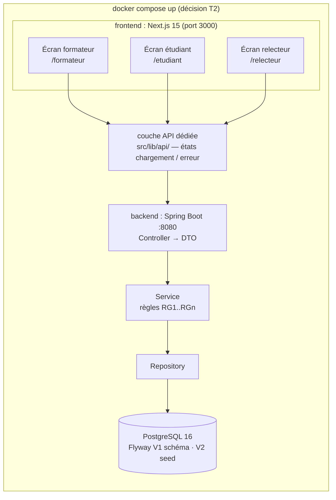
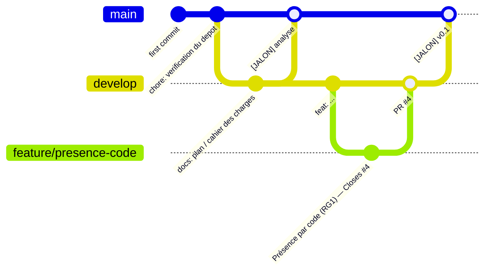

# PLAN D'IMPLÉMENTATION — ÉPREUVE FULLSTACK KFOKAM48

> Document de travail autonome. Un développeur qui n'a jamais vu l'épreuve doit pouvoir l'exécuter tel quel.
> Chaque affirmation est suivie de sa source : `[SUJET]`, `[LISEZ-MOI]`, `[CLIENT]`, `[CONTRAT]`, `[ENVELOPPE]`, `[MODÈLES]`.
> **Échéance unique : dépôt de `SOUMISSION.md` sur la plateforme avant 18h00** `[SUJET §AVANT DE COMMENCER]`.

---

## 0. Préambule documentaire

| Document | Rôle | Points clés extraits |
| --- | --- | --- |
| `LISEZ-MOI_CANDIDAT_KFOKAM48.pdf` (2 p.) | Instructions candidat, à lire en premier | Contenu du dossier `EPREUVE/` · vérif préalable `git` 2.x / `java` 17+ / `node` 18+ · création du dépôt public `kfokam48-epreuve-<matricule>` · test de push · **« l'enveloppe de l'étape 3 n'est pas dans le dossier, elle est remise par le surveillant une fois `[JALON] v0.1` poussé »** · le commit de test de connexion **n'est pas un jalon** (`chore: verification du depot`) · 5 points de vigilance (dépôt = copie d'examen, analyse d'abord, IA libre, pousser au fil de l'eau, 18h00) |
| `EPREUVE_FINALE_KFOKAM48_SUJET.pdf` (8 p.) | **Sujet principal — version faisant foi** (précisions n° 1 à 4) | **5 étapes** (étape 5 = soumettre) · barème **Git 30 / Produit 17** · un seul dépôt · pas d'épreuve Git annexe · besoin en 5 points · 6 sections de règles du jeu · contraintes B1–B6, F1–F3 · barème détaillé et malus · Annexes A (16 questions), B (contrat), C (modèles) |
| `assets/EPREUVE_KFOKAM48/` (fichier sans extension = **dossier**) | Dossier d'épreuve — **version obsolète sur la structure** (6 étapes), **mais commun** pour `CLIENT.md`, `api/contrat.yaml`, `modeles/` | `SUJET.pdf` + `SUJET.md` (**6 étapes**, étape 5 = épreuve Git → **supprimé**, précision n° 3), `CLIENT.md` (16 questions), `api/contrat.yaml` (contrat OpenAPI complet), `LISEZ-MOI.md`, `ENVELLOPE.md`, `modeles/` (`CAHIER_DES_CHARGES.md`, `JOURNAL.md`, `SOUMISSION.md`) |
| `ENVELOPPE_etape3_KFOKAM48.pdf` (2 p.) | Contenu de l'étape 3, remis après `[JALON] v0.1` | **Bug** : deux présences quasi simultanées, une seule enregistrée → issue avant de coder, test qui échoue, branche dédiée, test vert · **Changement de besoin** : **2 relecteurs par exercice, note = moyenne des deux, note d'un seul relecteur = « provisoire »** · touche base + contrat + frontend · analyse à mettre à jour, **nouvelle** migration (jamais modifier la existante), re-priorisation écrite, correctif et évolution séparés (2 branches, 2 PR) · **10 points** |
| `assets/PLAN_EPREUVE.md` (avant réécriture) | Plan existant, à adapter | Couvrait la variante B (6 étapes) · barèmes, malus, jalons, contradictions `Q10/Q15`, trous du `CLIENT.md`, RG1–RG15 · **incomplet** sur la comparaison des deux variantes du sujet, sur l'enveloppe (contenu réel non intégré), sur l'architecture cible et sur les estimations de durée |

### ✅ Précisions du professeur (dernière mise à jour) — elles font foi

Le sujet employait des termes ambigus ou deux versions divergentes. Voici les **quatre corrections** reçues, et ce qu'elles changent dans ce plan :

| # | Correction | Ce que ça change |
| --- | --- | --- |
| **1** | **« Ticket » devient « issue ».** Le sujet employait les deux mots sans dire que c'est la même chose. Désormais **un seul terme : issue**. Le sujet s'ouvre par « **Oui, tu dois créer des issues** », avec la définition, un **exemple d'issue complète** et la commande `Closes #4` pour fermer une issue depuis un commit. | Tout le plan parle uniquement d'**issue** ; la définition + l'exemple + `Closes #4` sont rappelés en §3 étape 1c et en §4.3. Aucune distinction ne subsiste entre « ticket » et « issue ». |
| **2** | **Le commit de test du LISEZ-MOI ne s'appelle plus `[JALON] depart`** : il devient **`chore: verification du depot`**. Il entrait en conflit avec la règle des trois jalons du sujet, au risque qu'un étudiant croie avoir déjà posé son jalon d'analyse **et écope d'un −5 immérité**. | Seuls trois commits portent le préfixe `[JALON]` : `analyse`, `v0.1`, `v1.0`. Voir §4.3 — le moindre autre commit `[JALON]…` est un risque de malus. |
| **3** | **L'étape 5 (épreuve Git) est supprimée** : l'épreuve sur dépôt fourni disparaît, **le bundle n'existait pas**. **« Soumettre » devient l'étape 5**, et le sujet parle de **cinq étapes partout**. | 5 étapes : Analyser → Construire → Enveloppe → Finaliser → Soumettre. Un seul dépôt public, barème **Git 30 / Produit 17**, plus aucun second dépôt ni `git-lab.bundle` dans ce plan. |
| **4** | **L'étape 3 ne mentionne plus le script `./enveloppe`** : l'enveloppe **se demande au surveillant**, une fois le commit `[JALON] v0.1` poussé. | §3 étape 3 et §6.4 : plus aucune référence au script. |

### 🎯 Décisions techniques validées (le 25/09) — à appliquer telles quelles

| # | Décision | Conséquences dans ce plan |
| --- | --- | --- |
| **T1** | **Frontend = Next.js 15** (App Router, **TypeScript**, composants **client**) | §2.1 · §2.2 · F1 justification en 1 ligne dans le README · F2 = 3 routes App Router · F3 = couche `src/lib/api/` unique |
| **T2** | **Front et backend dockerisés** : `docker compose up` → `postgres` + `backend` (Spring Boot) + `frontend` (Next 15, `next build` puis `next start`) | §2.1 · §2.2 (`docker-compose.yml`, `backend/Dockerfile`, `frontend/Dockerfile`) · §3 étape 2 · validation « clone vierge » = une seule commande |
| **T3** | **Seed de démonstration via une migration Flyway dédiée** (`V2__seed_demo.sql`), exécutée au démarrage du backend | §3 étape 2 · **numérotation des migrations : `V1` schéma, `V2` seed, `V3` changement de l'étape 3** (cf. §3 étape 3) · conforme B5 |
| **T4** | **Branche `develop` sous `main`** : toutes les PR ciblent `develop`, `develop` est la **branche par défaut** sur GitHub, `main` n'avance que par merge de `develop` **aux trois jalons** | §4.2 · §4.4 · §5 checklist |
| **T5** | **`assets/SUIVI_GIT.md`** : **chaque commit et chaque PR** y est tracé (date · branche · hash · message · issue · PR n°+lien), **mis à jour à chaque poussée** | §4.6 · §5 checklist — fichier versionné dans `assets/` (hors périmètre imposé, il ne gêne pas la structure `docs/·api/·backend/·frontend/`) |
| **T6** | **Jamais de co-author dans les commits** : l'auteur est **uniquement** le candidat (`user.name` / `user.email`), aucun trailer `Co-Authored-By`, aucune mention d'outil | §4.3 · §5 checklist |


### Note d'archive — deux versions du sujet détectées dans `assets/`

Les documents fournissaient deux variantes divergentes ; **les précisions ci-dessus tranchent en faveur de la variante A (les PDF à la racine)**, la variante B étant obsolète.

| Point | **Variante A — retenue** (PDF racine) | Variante B — obsolète (`EPREUVE_KFOKAM48/`) |
| --- | --- | --- |
| Nombre d'étapes | **5** (étape 5 = soumettre) `[SUJET-A §2]` | 6 (étape 5 = épreuve Git) `[SUJET-B §2]` |
| Épreuve Git annexe | **absente** (précision 3 : le bundle n'existait pas) | présente : `git-lab.bundle`, 2e dépôt, 17 pts |
| Barème Git / Produit | **30 / 17** | 32 / 15 |
| Enveloppe étape 3 | **demandée au surveillant** (précision 4) | script `./enveloppe` |
| Commit de test de push | **`chore: verification du depot`** (précision 2) | `[JALON] depart` |
| Terme unique | **issue** (précision 1) | « ticket » et « issue » mélangés |

> ⚠️ Les fichiers de `assets/EPREUVE_KFOKAM48/` restent utiles pour `CLIENT.md`, `api/contrat.yaml` et `modeles/`, dont le contenu est commun aux deux versions. **Seule la structure de l'épreuve (étapes, barème, enveloppe) suit la variante A.**

---

## 1. Compréhension du sujet

### 1.1 Objectif global

Livrer une application de **présence et de relecture par les pairs** pour la formation KFOKAM48, **et surtout** démontrer une démarche complète : analyser un besoin flou et contradictoire, le spécifier, le découper en **issues**, livrer par jalons, encaisser un changement de besoin en cours de route — le tout **lisible dans l'historique Git** `[SUJET §AVANT DE COMMENCER, §6 CONSEIL]`.

> « Ton dépôt est ta copie d'examen : le correcteur lira ton historique comme on lit une rédaction. » `[SUJET]`
> « L'application entière ne pèse que 17 points. » `[SUJET §6]` — *l'ancien libellé « 15 points » provenait de la version obsolète (variante B, 6 étapes), voir §0.*

### 1.2 Périmètre fonctionnel (les 5 besoins) `[SUJET §1 LE BESOIN]`

1. Un formateur ouvre une session de cours et obtient un **code de présence**.
2. Un étudiant saisit ce code pour **marquer sa présence**.
3. Un étudiant **dépose le lien** de son exercice pour une session.
4. Un étudiant est assigné à la **relecture** de l'exercice d'un pair : note et commentaire.
5. Le formateur voit un **tableau** : présence et moyenne des notes par étudiant.

La demande est **incomplète et se contredit par endroits** : deux réponses du `CLIENT.md` se contredisent, et il reste « un trou que personne n'a vu ». Le candidat doit trancher et **écrire** ses décisions `[SUJET §1]`.

**Évolution imposée à l'étape 3** `[ENVELOPPE §2]` : chaque exercice est relu par **deux** pairs, note retenue = **moyenne des deux** ; si un seul a rendu, sa note s'affiche **en attendant, marquée comme provisoire**.

### 1.3 Technologies imposées

| Domaine | Contrainte | Source |
| --- | --- | --- |
| Backend | **Java 17+ / Spring Boot / Maven**, wrapper `mvnw` **commité** (B1) | `[SUJET §3 B1]` |
| Contrat | `api/contrat.yaml` respecté **à la lettre** : chemins, verbes, codes HTTP, format d'erreur (B2) | `[SUJET §3 B2]`, `[CONTRAT]` |
| Archi backend | couches contrôleur/service/repository, DTO, jamais d'entité JPA en JSON (B3) | `[SUJET §3 B3]` |
| Robustesse | validation d'entrées + `@RestControllerAdvice`, jamais de stack trace client (B4) | `[SUJET §3 B4]` |
| Schéma | **Flyway ou Liquibase**, migrations commitées, `ddl-auto=update` interdit hors tests (B5) | `[SUJET §3 B5]` |
| Tests | 1 unitaire (règle métier réelle) + 1 intégration (endpoint), sur poste vierge (B6) | `[SUJET §3 B6]` |
| Frontend | **React \| Angular \| Next.js** au choix, justifié en 1 ligne dans le README, build qui passe (F1) | `[SUJET §3 F1]` |
| Écrans | 3 écrans : formateur, étudiant, relecteur (F2) | `[SUJET §3 F2]` |
| Front propre | couche d'appels API dédiée, états chargement/erreur, **aucune règle métier dupliquée** (F3) | `[SUJET §3 F3]` |
| Démarrage | `docker compose up` **ou 3 commandes max**, testées depuis un clone vierge, **+ données de démonstration** | `[SUJET §3 Démarrage]` |
| Langages docs | Markdown + **Mermaid/PlantUML texte** (aucun PNG) | `[SUJET §2b]` |

**Choix arrêtés (décisions T1–T3, cf. §0)** : frontend **Next.js 15** (App Router + TypeScript) · base **PostgreSQL** · **`docker compose up`** (`postgres` + `backend` + `frontend`) · seed de démo en migration Flyway **`V2__seed_demo.sql`**.

⚠️ **Information non trouvée dans les documents fournis** : aucune base de données, aucun hébergement ni framework de front n'est imposé par le sujet — ces choix relèvent du candidat et doivent être écrits en section 8 du cahier des charges.

### 1.4 Livrables attendus

| # | Livrable | Où | Source |
| --- | --- | --- | --- |
| L1 | `docs/CAHIER_DES_CHARGES.md` — 10 sections imposées, dans l'ordre | dépôt projet | `[SUJET §2a]` |
| L2 | 3 diagrammes Mermaid/PlantUML texte : **D1** cas d'utilisation, **D2** classes/modèle (cohérent avec les migrations), **D3** séquence « marquer sa présence » nominal + **code expiré** + **déjà présent** (cohérent avec les codes HTTP) — **+D4** états-transitions = bonus +3 | `docs/diagrammes/` | `[SUJET §2b]` |
| L3 | Backlog en **issues GitHub** : titre = un résultat, critères « quand… alors… », priorité Must/Should/Could, renvoi `EFx`/`RGx`, ≈10 issues | onglet Issues | `[SUJET §2c]` |
| L4 | `api/contrat.yaml` complété **et figé avant le premier commit de code** (5 pts) | `api/` | `[SUJET §2d]` |
| L5 | 3 commits vides `[JALON] analyse`, `[JALON] v0.1`, `[JALON] v1.0` **dans cet ordre et poussés** | historique | `[SUJET §2]` |
| L6 | Code backend Spring Boot conforme B1–B6 | `backend/` | `[SUJET §3]` |
| L7 | Frontend 3 écrans conforme F1–F3 | `frontend/` | `[SUJET §3]` |
| L8 | Après l'étape 3 : analyse **mise à jour** (3 pts), nouvelle migration, contrat mis à jour, sacrifice de périmètre **écrit** | dépôt | `[ENVELOPPE]` |
| L9 | Étape 4 : `CHANGELOG.md` cohérent, `README` testé depuis un clone vierge, backlog trié | racine | `[SUJET §2 étape 4]` |
| L10 | `docs/JOURNAL.md` : **une entrée par étape**, écrite au moment où l'étape se termine | `docs/` | `[SUJET §4 Journal]` |
| L11 | `SOUMISSION.md` téléversé sur la plateforme **avant 18h00** — sans lui, rien n'est rendu | plateforme | `[SUJET §2 étape 5]`, `[LISEZ-MOI §4]` |

### 1.5 Critères d'évaluation (barème sur 100)

| Bloc | Pts | Détail |
| --- | ---: | --- |
| Analyse & conception | **38** | Cahier des charges 10 · 3 diagrammes 12 · Backlog (issues) 8 · Contrat figé avant le code 5 · Analyse mise à jour après étape 3 : 3 · *bonus D4 : +3* |
| Conduite du changement (étape 3) | **10** | Issue ouverte avant de coder, bug reproduit par un test, migration versionnée, contrat mis à jour, re-priorisation écrite, correctif/évolution séparés `[ENVELOPPE]` |
| Git | **30** | Commits atomiques + messages explicites 8 · une branche par issue, une PR par branche, PR rattachée à son issue 7 · les 3 commits `[JALON]` présents, poussés et dans l'ordre 5 · `.gitignore` Java + JS posé avant le premier commit de code, aucun fichier généré 5 · `main` toujours sain, aucun secret 5 |
| Produit & conformité | **17** | Contrat + codes HTTP justes, erreurs comprises 7 · Conformité B3–B6 et F1–F3 7 · Démarre chez un tiers depuis le seul README, avec données de démo 3 |
| Journal | **5** | Une entrée **par étape**, écrite en temps réel |
| **Total** | **100** | |

**Malus** `[SUJET §4 Malus]` : secret ou `target/`·`node_modules/`·`dist/` commités **−5** · aucune issue de la journée **−10** · un seul commit ou historique concentré sur la dernière heure **−10** · `[JALON] analyse` manquant ou après le premier commit de code **−5** · `push --force` destructeur sur `main` du projet **−5** · dépôt privé / lien mort / hash invalide = **partie non corrigée**.

---

## 2. Architecture technique

### 2.1 Stack

- **Frontend : Next.js 15 (App Router) + TypeScript**, composants **client** (`'use client'`) pour les trois écrans — *décision T1*.
  *Justification 1 ligne à mettre dans le `README` (F1)* : « Next.js 15 (App Router) choisi pour ses trois écrans en routes natives, sa couche serveur légère et son build statique de production ; aucun rendu côté serveur applicatif n'est exigé. »
  *Forme retenue :* pas de Server Components ni de Route Handlers proxy — les pages appellent le backend directement **via une seule couche dédiée** `src/lib/api/` (F3), ce qui garde les états chargement/erreur explicites.
- **Backend : Java 21 / Spring Boot 3 / Maven**, wrapper `mvnw` commité `[SUJET §3 B1]`.
- **Persistance : PostgreSQL + Flyway** (`V1` schéma, `V2` seed de démo), **H2 en mémoire pour les tests** (poste vierge, B5/B6). Base non imposée par le sujet ⚠️ (hypothèse à écrire en section 8 du cahier des charges).
- **Seed de démonstration : migration Flyway `V2__seed_demo.sql`** — *décision T3* : une promotion, ~8 étudiants, 2 sessions (une ouverte, une clôturée), quelques présences et exercices. Elle tourne **au démarrage du backend**, donc à chaque `docker compose up`, et survive aux migrations suivantes.
- **Conteneurisation : `docker compose up`** — *décision T2* — trois services :

  | Service | Image / build | Port | Rôle |
  | --- | --- | --- | --- |
  | `postgres` | `postgres:16-alpine` | 5432 (interne) | base, volume persistant |
  | `backend` | `backend/Dockerfile` (multi-stage : `maven:3.9-eclipse-temurin-21` → `eclipse-temurin:21-jre`) | 8080 | Spring Boot, Flyway + seed au boot |
  | `frontend` | `frontend/Dockerfile` (multi-stage : `node:20-alpine` → `next build` → `next start`) | 3000 | Next.js 15 |

  Une seule commande au démarrage → conforme à « `docker compose up`, ou trois commandes maximum » `[SUJET §3 Démarrage]`.

### 2.2 Arborescence cible (structure imposée `[SUJET §Ton dépôt]`)

```
kfokam48-epreuve-<matricule>/
├── .gitignore                  # Java + JS, posé AVANT le premier commit de code
├── README.md                   # install, démarrage (docker compose up), choix du front justifié (F1)
├── CHANGELOG.md                # étape 4
├── docker-compose.yml          # postgres + backend + frontend (décision T2)
├── assets/
│   ├── PLAN_EPREUVE.md         # ce document
│   └── SUIVI_GIT.md            # chaque commit et chaque PR (décision T5)
├── docs/
│   ├── CAHIER_DES_CHARGES.md   # 10 sections
│   ├── JOURNAL.md              # 1 entrée par étape
│   └── diagrammes/             # D1-D4 en Mermaid
│       ├── D1-cas-d-utilisation.md
│       ├── D2-modele-de-donnees.md
│       ├── D3-sequence-presence.md
│       └── D4-etats-exercice.md   # bonus
├── api/
│   └── contrat.yaml            # figé avant le 1er commit de code
├── backend/                    # Spring Boot (Java 17+, Maven, mvnw)
│   ├── Dockerfile              # multi-stage maven → jre
│   ├── pom.xml · mvnw · mvnw.cmd
│   └── src/main/java/.../{controller,service,repository,dto,config,exception}
│       └── src/main/resources/{application.yml, db/migration/V1__init.sql, V2__seed_demo.sql, V3__*.sql}
│       └── src/test/java/...   # 1 unitaire + 1 intégration (B6)
└── frontend/                   # Next.js 15 (App Router, TypeScript)
    ├── Dockerfile              # multi-stage next build → next start
    ├── next.config.ts · tsconfig.json · package.json
    └── src/
        ├── app/                # F2 — 3 écrans = 3 routes
        │   ├── formateur/page.tsx      # ouvrir une session + tableau
        │   ├── etudiant/page.tsx       # marquer sa présence + déposer son exercice
        │   └── relecteur/page.tsx      # faire une relecture
        ├── lib/api/            # F3 — UNIQUE couche d'appels API
        ├── components/         # états chargement / erreur
        └── types/              # types partagés avec le contrat
```

**Numérotation des migrations (décision T3) :** `V1__init.sql` (schéma conforme à D2) · `V2__seed_demo.sql` (données de démo) · `V3__deux_relecteurs.sql` (étape 3, **ajoutée**, `V1`/`V2` jamais modifiées).

### 2.3 Schéma d'architecture (Mermaid)



*Contraintes respectées :* aucune requête base dans un contrôleur, aucune entité JPA exposée (DTO), erreurs centralisées par `@RestControllerAdvice` renvoyant `{code,message}` `[SUJET §3 B3/B4]`, moyenne calculée **côté API** uniquement `[SUJET §3 F3]`, seed en migration Flyway donc identique pour tous les correcteurs `[SUJET §3 Démarrage]`.

### 2.4 Modèle de données minimal (à aligner sur D2 et les migrations)

`Promotion` 1—N `Etudiant` · `Session` (titre, promotionId, ouvertureAt, expirationAt, code, statut OUVERTE/CLOTUREE) · `Presence` (session, etudiant, source `ETUDIANT|FORMATEUR`, UNIQUE(session, etudiant)) · `Exercice` (session, etudiant, lien, statut `DEPOSE|EN_ATTENTE|RELU`) · `Relecture` (exercice, relecteur, note 0–20, commentaire, statut `EN_ATTENTE|RENDUE|PROVISOIRE`) — la cardinalité passe de **1 à 2 relecteurs** à l'étape 3 `[CLIENT Q6]` → `[ENVELOPPE §2]`.

---

## 3. Plan d'implémentation étape par étape

> **Ordre imposé par le sujet** : les 5 étapes se suivent **dans l'ordre**, et l'ordre se lit dans l'historique Git `[SUJET §2]`.
> **Règle absolue : aucun code avant le commit `[JALON] analyse`.** `[SUJET §2 étape 1]`, `[LISEZ-MOI §3.2]`

### Étape 0 — Mise en place du dépôt (prérequis)

- **Objectif** : avoir un dépôt conforme, public, poussable, avec l'arbre de branches et le suivi en place, avant toute analyse.
- **Tâches détaillées** :
  1. ✅ **Fait** — `git 2.x` · `java 21` · `node 24` · `mvn` · `docker` : environnement conforme `[LISEZ-MOI §2a]`.
  2. ✅ **Fait** — dépôt GitHub **public** `kfokam48-epreuve-257` créé (⚠️ confirmer que `257` est bien le matricule complet, cf. §4.1) `[LISEZ-MOI §2c]`.
  3. ✅ **Fait** — push vérifié sur `main` puis sur `develop` (les poussées successives font foi). Ce type de commit de test **n'est pas** un jalon, ne jamais utiliser le préfixe `[JALON]` ailleurs `[LISEZ-MOI §2d]`.
  4. ✅ **Fait** — **arbre de branches posé (décision T4)** :
     ```bash
     git checkout -b develop              # à partir de main
     git push -u origin develop
     gh repo edit --default-branch develop    # develop = branche par défaut — VÉRIFIÉ
     ```
     `main` ne devient qu'une branche « release » : elle n'avance que par merge de `develop` **aux trois jalons** (§4.2).
  5. ✅ **Fait** — `.gitignore` réécrit : ignores des seuls documents d'épreuve + entrées Java/JS (`target/`, `node_modules/`, `dist/`, `.env`) **avant le premier commit de code** `[SUJET §4 Git 5 pts]` (détail §4.1).
  6. ✅ **Fait** — **`assets/SUIVI_GIT.md`** créé (décision T5) avec backfill des commits existants. Désormais, **tout commit et toute PR** y figurent (§4.6).
  7. ☐ **À faire** — créer l'arborescence `docs/ docs/diagrammes/ api/`, y copier `contrat.yaml` et les 3 modèles depuis `assets/EPREUVE_KFOKAM48/`.
- **Livrable** : dépôt public conforme, `develop` = branche par défaut, `.gitignore` complet, `assets/SUIVI_GIT.md` initialisé, arborescence créée.
- **Validation** : `git clone` de test dans `/tmp` → branche locale `develop` et non `main` ; `git push` accepté ; `.gitignore` contient bien `target/`, `node_modules/`, `dist/`, `.env` ; `assets/SUIVI_GIT.md` liste chaque commit existant.
- **Estimation** : 30 min.

### Étape 1 — Analyser, spécifier, concevoir — **38 pts, aucun code**

- **Objectif** : produire les 4 livrables d'analyse puis poser `[JALON] analyse`.
- **Tâches détaillées** :
  1. **`docs/CAHIER_DES_CHARGES.md`** — 10 sections dans l'ordre imposé `[SUJET §2a]` :
     1. Contexte et objectif · 2. Acteurs et rôles · 3. Périmètre (**inclus et explicitement exclus**) · 4. Exigences fonctionnelles `EF1…` avec critère « quand… alors… » + priorité · 5. Exigences non fonctionnelles (volumétrie, mobile, temps de réponse) · 6. Règles de gestion `RG1…` **avec source `Qx`** · 7. Zones d'ombre, hypothèses et **contradictions tranchées** · 8. Contraintes techniques (B1–B6, F1–F3) · 9. Livrables · 10. Démarche prévue + **Definition of Done**.
  2. **3 diagrammes Mermaid** dans `docs/diagrammes/` (D1 cas d'utilisation, D2 classes/cardinalités **cohérent avec les migrations**, D3 séquence présence nominal + **410 CODE_EXPIRE** + **409 DEJA_PRESENT** **cohérent avec le contrat**) + **D4 bonus** états-transitions de l'exercice `[SUJET §2b]`.
  3. **Backlog en issues** — *précision n° 1 du professeur : il n'y a qu'un seul mot, « issue » ; « ticket » est abandonné.*

     > **Oui, tu dois créer des issues.** Une issue est une **fiche de travail que tu ouvres toi-même** dans l'onglet Issues de ton dépôt GitHub. **Une issue = une chose à faire.** Elles constituent ton plan de travail, et c'est à elles que tu rattacheras tes branches et tes commits `[SUJET §2c]`.
     >
     > *L'ancienne rédaction du sujet utilisait aussi le mot « ticket » : c'était la même chose. **Un seul terme est désormais employé : issue** (précision n° 1).*

     Compte **une dizaine d'issues** pour ce projet. Chacune porte :
     - un titre qui décrit **un résultat**, pas une tâche technique — « L'étudiant marque sa présence avec un code », pas « créer l'entité Presence » ;
     - des **critères d'acceptation vérifiables**, formulés « quand … alors … » ;
     - une **priorité** : Must, Should ou Could ;
     - le **renvoi** à l'exigence `EFx` ou à la règle `RGx` du cahier des charges.

     **Exemple d'issue complète** (modèle imposé par le sujet) :

     > **Titre : L'étudiant marque sa présence avec un code**
     > *Réf. EF1 · Règles RG1 (expiration 15 min), RG5 (une seule présence par session) · Priorité Must · Estimation 2 h*
     > **Critères d'acceptation**
     > - Quand je saisis un code valide et non expiré, ma présence apparaît dans le tableau du formateur
     > - Quand le code a plus de 15 minutes, je reçois une erreur `410 CODE_EXPIRE`
     > - Quand j'ai déjà marqué ma présence, je reçois une erreur `409 DEJA_PRESENT`

     **Fermeture depuis un commit** — pendant la construction, une branche par issue, et un commit qui la ferme en la citant :

     ```bash
     git checkout -b feature/presence-code
     git commit -m "Enregistrement d'une présence par code (RG1) — Closes #4"
     ```

     Écrire **`Closes #4`** dans le message ferme automatiquement l'issue n° 4 quand la branche est fusionnée. **C'est ce lien entre ton plan et ton code que le correcteur regarde.**
  4. **`api/contrat.yaml` complété** : les 5 opérations imposées **plus** celles nécessaires — à minima : ouverture/clôture de session (trou du `CLIENT.md`, §6.2), liste des sessions, création d'une relecture « en attente » (**nécessaire** : `POST /api/relectures/{id}` opère sur une relecture déjà existante), présence ajoutée par le formateur (Q14), gestion des tentatives échouées (Q4, `429`), tableau de l'étudiant (Q8/Q16) `[CONTRAT]`, `[SUJET §2d]`.
  5. **Trancher les contradictions et trous** (§6) dans la section 7 du cahier des charges, en citant `Qx`.
  6. Entrée « Étape 1 » du `JOURNAL.md` (Fait / Bloqué / IA) `[SUJET §4 Journal]`.
  7. `git add` + commit des docs, puis **`git commit --allow-empty -m "[JALON] analyse"` + `git push`** `[SUJET §2]`.
- **Livrable** : cahier des charges complet, 4 diagrammes, ≈10 issues, contrat figé, jalon d'analyse poussé.
- **Validation** : le commit `[JALON] analyse` existe **avant** tout commit contenant du code (ordre dans l'historique = ce qui est noté) ; chaque `EFx`/`RGx` cité existe ; D2 correspond ligne à ligne aux migrations ; D3 correspond aux codes du contrat.
- **Estimation** : 3 h à 3 h 30.

### Étape 2 — Construire la première version (stories **Must** uniquement)

- **Objectif** : un incrément fonctionnel et démontrable, derrière une discipline Git irréprochable.
- **Tâches détaillées** :
  1. **Backend** : création du projet Maven Spring Boot (**maintenant autorisé**) ; committer `mvnw` + `.gitattributes` (B1).
  2. **Flyway + seed (décisions T3)** : `V1__init.sql` = schéma conforme à **D2**, `V2__seed_demo.sql` = données de démo (promotion, ~8 étudiants, 2 sessions dont une clôturée, présences, exercices). **Avant toute donnée** — « la plupart de ceux qui souffriront à l'étape 3 souffriront pour une seule raison : un schéma de base non versionné » `[SUJET §6]`.
  3. Implémenter les 5 opérations du contrat à la lettre (B2), en couche Controller → Service → Repository, DTO obligatoires (B3), validation + `@RestControllerAdvice` centralisé renvoyant `{code,message}` (B4).
  4. Tests : 1 unitaire sur une règle réelle (ex. expiration 15 min = RG1) + 1 intégration sur un endpoint, **sur H2** pour tourner sur poste vierge (B6).
  5. **Frontend Next.js 15** (décision T1) : `create-next-app` (App Router + TypeScript), les **3 écrans** en routes `src/app/{formateur,etudiant,relecteur}` (F2), **une seule** couche d'appels `src/lib/api/` (F3), états chargement/erreur, moyenne **jamais recalculée** côté client (F3), base URL du backend via `NEXT_PUBLIC_API_URL`.
  6. **Dockerisation (décision T2)** : `backend/Dockerfile` (multi-stage Maven → JRE), `frontend/Dockerfile` (multi-stage `next build` → `next start`), `docker-compose.yml` (`postgres` + `backend` + `frontend`), `depends_on` + `healthcheck` pour que Flyway/seed tournent après la montée de Postgres.
  7. **Une branche par issue**, une **PR par branche** — **la PR cible `develop`** (décision T4) — commit fermant l'issue : `git commit -m "Enregistrement d'une présence par code (RG1) — Closes #4"` `[SUJET §2c]`.
  8. Pousser **au fil de l'eau** ; **mettre à jour `assets/SUIVI_GIT.md` à chaque push** (décision T5) ; entrée « Étape 2 » du `JOURNAL.md`.
  9. Merge `develop` → `main`, **puis** `git commit --allow-empty -m "[JALON] v0.1"` sur `main` + push `[SUJET §2]` (§4.2).
- **Livrable** : v0.1 démontrable en une commande, issues Must fermées par des PR sur `develop`, jalon poussé sur `main`, suivi à jour.
- **Validation** : **clone vierge + `docker compose up`** → app opérationnelle **avec les données de démo** sur `:3000`, API sur `:8080` ; `./mvnw test` vert sans base locale ; `npm run build` vert ; aucune issue ouverte sans PR ; `assets/SUIVI_GIT.md` à jour.
- **Estimation** : 5 h à 6 h (Next 15 + Docker compris).

### Étape 3 — Ouvrir l'enveloppe — **10 pts de conduite du changement**

- **Objectif** : encaisser le bug + le changement de besoin **à la méthode**, ce qui est ce qui est noté.
- **Tâches détaillées** (dans cet ordre, l'ordre se lit dans l'historique) :
  1. **Demander l'enveloppe au surveillant**, en lui donnant l'adresse de ton dépôt — elle ne te sera remise qu'une fois ton commit `[JALON] v0.1` poussé, et tu ne peux pas l'obtenir avant `[SUJET §2 étape 3]`, `[LISEZ-MOI §1]`. *(Précision n° 4 : aucun script, pas de `./enveloppe`.)*
  2. **Bug — présences simultanées perdues** `[ENVELOPPE §1]` :
     - ouvrir une **issue** décrivant le problème **et la façon de le reproduire** *avant* de toucher au code ;
     - écrire un **test qui échoue** (deux `POST /api/presences` concurrents, une seule présence) ;
     - corriger dans une **branche dédiée**, commit référençant l'issue (cause probable : contrainte d'unicité non gérée / read-then-write non atomique → contrainte DB `UNIQUE(session, etudiant)` + gestion du `DataIntegrityViolationException` → `409`) ;
     - re-vérifier le test au vert.
  3. **Changement de besoin — 2 relecteurs, moyenne, note provisoire** `[ENVELOPPE §2]` :
     - **mettre à jour l'analyse** (cdd : RG issue de `Q6`, exigences, section 7 + diagrammes devenus faux) **dans un commit qui le dit** (3 pts) ;
     - mettre à jour `api/contrat.yaml` si la forme des réponses change ;
     - **nouvelle migration `V3__deux_relecteurs.sql`**, jamais modifier `V1` (schéma) ni `V2` (seed), la base remplie doit survivre (décision T3) ;
     - découper en **issues** et **re-prioriser** : ce Must tardif fait sortir quelque chose du périmètre → **écrire le sacrifice** dans le journal ou le cahier des charges ;
     - **2 branches, 2 PR** (les deux ciblent `develop`) : correctif et évolution ne mélangent jamais un commit ;
- **Livrable** : issue + test rouge + fix d'un côté, migration V2 + analyse mise à jour + contrat mis à jour + sacrifice écrit de l'autre.
- **Validation** : la chronologie Git prouve que l'issue précède le premier commit de correction ; les migrations `V1` et `V2` sont **inchangées** dans le diff (seul `V3` apparaît) ; la base de démo peuplée par `V2` contient toujours ses données après `V3` ; les 2 PR sont distinctes ; les 6 lignes du tableau de l'enveloppe sont cochables.
- **Estimation** : 1 h 30 à 2 h.

### Étape 4 — Livrer la version finale

- **Objectif** : un état livrable, traçable et vérifiable par un tiers.
- **Tâches détaillées** :
  1. **`git commit --allow-empty -m "[JALON] v1.0"`** + push.
  2. `CHANGELOG.md` **cohérent avec l'historique réel** (aucun élément absent de l'historique).
  3. `README` d'installation **testé depuis un clone vierge dans un dossier vide** : installation, démarrage (3 commandes max), choix du front justifié en 1 ligne (F1), données de démo.
  4. Backlog restant trié (issues fermées/ouvertes avec priorité à jour).
  5. Mise à jour finale du `JOURNAL.md`.
- **Livrable** : release v1.0, changelog, README validé.
- **Validation** : dans un dossier vide : `git clone … && <commande 1> && <commande 2> && <commande 3>` → application opérationnelle **avec données de démonstration**.
- **Estimation** : 45 min.

### Étape 5 — Soumettre — **sans elle, rien n'est rendu** *(5 étapes au total — précision n° 3)*

- **Objectif** : rendre effectivement le travail.
- **Tâches détaillées** :
  1. Remplir `SOUMISSION.md` (modèle `modeles/SOUMISSION.md`) : nom, matricule, centre, URL du dépôt, **hash complet 40 caractères**, frontend choisi, commande de démarrage `[SUJET §2 étape 5]`. *Le modèle fourni comporte une section « Épreuve Git — étape 5 » : **elle disparaît** (précision n° 3), de même que la case « Mes deux dépôts » de la check-list finale.*
  2. Pousser **tout** avant de relever le hash : « la correction porte exactement sur le commit que tu déclares. Tout ce que tu pousses après est ignoré. »
  3. Vérifier l'adresse du dépôt **en fenêtre de navigation privée** ; dépôt **public**, à conserver jusqu'à la publication des résultats.
  4. Téléverser sur la plateforme **bien avant 18h00** (« Ne soumets pas à 17h58 »).
- **Livrable** : `SOUMISSION.md` accepté par la plateforme.
- **Validation** : ouverture du lien en navigation privée, hash de 40 caractères existant sur GitHub, `git status` propre et tout poussé.
- **Estimation** : 20 min (**+ marge de sécurité : viser 17h00**).

### Synthèse des estimations

| Étape | Durée | Réserve |
| --- | ---: | ---: |
| 0 — Mise en place (branches + suivi) | 30 min | |
| 1 — Analyse (38 pts) | 3 h 30 | **ne pas la comprimer** |
| 2 — v0.1 (backend + Next 15 + Docker) | 5 h 30 | le plus long : Docker/Next sont neufs |
| 3 — Enveloppe (10 pts) | 2 h | |
| 4 — Final | 45 min | |
| 5 — Soumission | 20 min | fin opérationnelle visée **17h00** |
| **Total** | **≈ 12 h 35** | ~30 min de marge |

⚠️ **Information non trouvée dans les documents fournis** : horaire exact d'ouverture de l'épreuve. Seule l'échéance de 18h00 est donnée `[SUJET]`.

---

## 4. Gestion du dépôt Git

### 4.1 État actuel du dépôt et écarts à corriger **avant** tout code

| Constat | Vérification | Action |
| --- | --- | --- |
| Remote `https://github.com/Brahimi-Talla01/kfokam48-epreuve-257.git` | `git remote -v` | ⚠️ Le nom imposé est `kfokam48-epreuve-<matricule>` avec un matricule type `KF48-YAO-042` `[LISEZ-MOI §2c]`. Si `257` n'est pas le matricule complet, **renommer sur GitHub (Settings → Rename)** + `git remote set-url`. |
| Un seul commit `first commit` (README.md seul) | `git log --oneline` | Acceptable tant qu'il n'y a **pas** de code ; le message est faible mais n'entre dans aucun malus tant que l'historique reste lisible. |
| `.gitignore` = **`/assets`** seulement (et non suivi) | `cat .gitignore` | ⚠️ **Non conforme** à « .gitignore Java + JS posé avant le premier commit de code » (5 pts). **Décision appliquée :** on ne garde l'ignore que sur les documents d'épreuve (`/assets/*.pdf`, `/assets/EPREUVE_KFOKAM48/`, `/assets/INIT.md`) et on complète avec les entrées Java + JS (`target/`, `node_modules/`, `dist/`, `.idea/`, `.env`, `*.log`). |
| `assets/` entièrement ignoré donc le plan non versionné | `git check-ignore -v assets/PLAN_EPREUVE.md` | **Résolu** par la ligne ci-dessus : `assets/PLAN_EPREUVE.md` devient suivi. Les documents d'épreuve (PDF, dossier `EPREUVE_KFOKAM48/`) restent hors du dépôt public : la structure imposée n'autorise que `docs/ · api/ · backend/ · frontend/`. *Alternative à retenir plus tard : migrer ce plan vers `docs/PLAN_EPREUVE.md`.* |
| Visibilité du dépôt | à vérifier sur GitHub | **Publique** — un dépôt privé = partie non corrigée `[SUJET §Ton dépôt]`. |

### 4.2 Stratégie de branches (décision T4)



| Branche | Rôle | Qui la pousse |
| --- | --- | --- |
| `develop` | **Branche par défaut** (sur GitHub) et branche d'intégration : **toutes les PR visent `develop`** | après chaque PR merge, et à chaque jalon |
| `main` | Branche « release » : **elle n'avance que par merge (fast-forward) de `develop` aux trois jalons** — toujours saine, toujours poussée | aux jalons uniquement |
| `feature/<slug-issue>` | **Une branche par issue**, créée depuis `develop`, mergée par une **PR unique dans `develop`** | le commit de la PR |
| `fix/…` · `evolution/…` | Même règle, pour séparer **correctif** et **évolution** à l'étape 3 (2 branches, 2 PR) | |

**Cadre strict :**
- **Jamais de `push --force` destructeur** (−5) : aucun endroit de l'épreuve ne l'autorise.
- `main` ne reçoit **jamais** de commit direct : uniquement des merges de `develop`.
- **Jalon** : commit vide créé sur `develop`, poussé, puis remonté sur `main` par `git merge --ff-only develop` → historique `main` linéaire et lisible, `[JALON] analyse` forcément **avant** le premier commit de code.
- `release` inutile ; la PR est l'unité de revue, **rattachée à son issue** (7 pts).

### 4.3 Convention de commits

- Messages **en français**, impératif, une idée par commit : `Enregistrement d'une présence par code (RG1) — Closes #4` `[SUJET §2c]`.
- Toujours citer la règle/l'exigence (`RG1`, `EF4`) **et/ou** l'issue (`#12`).
- Interdits : `update`, `fix`, `test2` (valent zéro) `[SUJET §4 Git]`.
- **Aucun co-author** — *décision T6 :* chaque commit porte **exclusivement** l'identité du candidat (`git config user.name` / `user.email`). **Pas de trailer `Co-Authored-By`**, pas de mention d'outil ou d'IA dans le message. L'IA est autorisée, mais c'est **toi l'auteur** de chaque commit (le journal est l'endroit où l'on dit ce qu'on a demandé à l'IA, pas les messages de commit) `[SUJET §5 RÈGLES]`.
- Trois commits **vides de code**, messages **exacts** :

  ```bash
  git commit --allow-empty -m "[JALON] analyse"   # fin étape 1, AVANT tout code
  git commit --allow-empty -m "[JALON] v0.1"      # fin étape 2, débloque l'enveloppe
  git commit --allow-empty -m "[JALON] v1.0"      # étape 4
  git push
  ```

  « Un jalon non poussé n'existe pas. » `[SUJET §2]`. Ne **jamais** réutiliser le préfixe `[JALON]` pour autre chose `[LISEZ-MOI §2d]`.

  > ⚠️ **Précision n° 2** : le commit de test de connexion du LISEZ-MOI s'appelle **`chore: verification du depot`**, pas `[JALON] depart`. Ce dernier entrait en conflit avec la règle des trois jalons : un étudiant pourrait croire avoir déjà posé son jalon d'analyse **et écopter d'un −5 immérité**. Un seul commit hors des trois ci-dessus doit porter le préfixe `[JALON]`, et aucun.

### 4.4 Commandes essentielles

```bash
# --- mise en place (étape 0) ---
git checkout -b develop && git push -u origin develop
gh repo edit --default-branch develop

# --- cycle normal d'une issue ---
git checkout develop && git pull
git checkout -b feature/presence-code
# ... travailler, committer par idées atomiques ...
git commit -m "Enregistrement d'une présence par code (RG1) — Closes #4"
git push -u origin feature/presence-code
gh pr create --base develop --fill      # PR liée à l'issue, cible develop
gh pr merge --squash --delete-branch    # ferme l'issue si "Closes #4"
# → mettre assets/SUIVI_GIT.md à jour (§4.6), committer, pousser sur develop

# --- jalon : commit vide sur develop, remontée sur main ---
git commit --allow-empty -m "[JALON] v0.1"
git push
git checkout main && git merge --ff-only develop && git push
git checkout develop

# --- vérifications répétées avant chaque push ---
git status --short
git log --oneline --graph --decorate -15
git log -1 --format='%an <%ae>'        # uniquement ton identité, jamais de co-author (T6)
git grep -nE "target/|node_modules/|dist/" --name-only
```

> **Note sur `gh` :** si la CLI GitHub n'est pas disponible ou pas autorisée, les mêmes opérations se font dans l'onglet GitHub (Issues → New, Compare & pull request, Merge). **Ce qui compte pour le barème, c'est l'issue, la branche, la PR et le lien entre eux** — pas l'outil qui les a créés.

### 4.5 Synchronisation avec le remote

- Pousser **après chaque PR merge** et **après chaque entrée de journal** ; jamais tout pousser à la fin (historique concentré sur la dernière heure = −10).
- Vérifier régulièrement que `origin/develop` et `origin/main` sont conformes au local : `git fetch --all && git status` + `git log --oneline origin/develop -5`.
- Pousser **au fil de l'eau**, jamais un gros batch final : « un travail excellent resté en local vaut zéro » `[SUJET §Ton dépôt]`.
- Aucun secret (token, `.env`) **jamais** commité : −5 et partie potentiellement non corrigée.

### 4.6 Fichier de suivi — `assets/SUIVI_GIT.md` (décision T5)

**Règle :** chaque commit et chaque pull request de ce dépôt y figure, **mis à jour dans le même mouvement que la poussée**. Seule exception auto-référente : la ligne du commit qui modifie ce fichier porte la mention *(ce commit)*, son hash étant complété à la mise à jour suivante.

**Format :**

```markdown
# Suivi Git — dépôt kfokam48-epreuve-<matricule>

> Traçabilité de tous les commits et de toutes les pull requests.
> Règle : une ligne par objet, ajoutée dès qu'il est poussé (décision T5).

## Pull requests

| # | Titre | Branche source | Branche cible | Issue | État | Lien |
|---|---|---|---|---|---|---|
| 4 | L'étudiant marque sa présence avec un code | `feature/presence-code` | `develop` | #4 | merged | https://github.com/…/pull/4 |

## Commits

| Date | Branche | Hash | Message | Issue / PR | Étape |
|---|---|---|---|---|---|
| 2026-09-25 | `main` | `07a7d22` | docs: plan d'implémentation enrichi… | — | 0 |
| 2026-09-25 | `develop` | `abc1234` | Enregistrement d'une présence par code (RG1) — Closes #4 | #4 · PR 4 | 2 |
```

**Obligations :**
- **Toute PR** du dépôt a sa ligne (titre, source, cible `develop`, issue liée, état, lien).
- **Tout commit poussé** a sa ligne : date, branche, hash court, message exact, renvoi issue/PR, étape de l'épreuve.
- La colonne « étape » relie le travail à la chronologie officielle (0 à 5) : le correcteur voit d'un coup d'œil où en est le travail.
- Le fichier est lui-même versionné et poussé sur `develop` ; il est repris dans le merge vers `main` à chaque jalon.

---

## 5. Checklist finale

**Conformité structure et dépôt**
- [ ] Dépôt **public** `kfokam48-epreuve-<matricule>` (nom exact, matricule complet) — **un seul dépôt**
- [ ] `develop` est la **branche par défaut** sur GitHub ; toutes les PR ciblent `develop` (T4)
- [ ] `main` n'a reçu **que** des merges de `develop` (fast-forward aux 3 jalons), jamais de commit direct
- [ ] Structure `docs/ · api/ · backend/ · frontend/` respectée (+ `docker-compose.yml` à la racine)
- [ ] **`assets/SUIVI_GIT.md`** à jour : chaque commit et chaque PR tracé (T5)
- [ ] Chaque commit : **auteur unique = moi**, aucun `Co-Authored-By` (T6) — vérifié avec `git log -1 --format='%an <%ae>'`
- [ ] `.gitignore` Java + JS posé **avant** le premier commit de code, aucun fichier généré dans l'historique
- [ ] Aucun secret nulle part dans l'historique
- [ ] `main` toujours sain, aucun `push --force` destructeur

**Analyse (38 pts)**
- [ ] `docs/CAHIER_DES_CHARGES.md` : 10 sections, dans l'ordre, `EFx` et `RGx` numérotés, critères « quand… alors… »
- [ ] Section 7 : contradictions `Q10/Q15` tranchées **et justifiées**, trous identifiés avec décision écrite
- [ ] D1, D2, D3 en Mermaid texte ; **D2 ≡ migrations**, **D3 ≡ codes HTTP du contrat**
- [ ] D4 (bonus) états-transitions de l'exercice
- [ ] ≈10 issues : titre = résultat, critères vérifiables, priorité Must/Should/Could, renvoi `EFx`/`RGx`
- [ ] `api/contrat.yaml` complété **et figé avant le premier commit de code**

**Jalons (3 × malus −5)**
- [ ] `[JALON] analyse` **avant** le premier commit de code, poussé
- [ ] `[JALON] v0.1` poussé (condition d'obtention de l'enveloppe)
- [ ] `[JALON] v1.0` poussé
- [ ] Les trois, **dans cet ordre**
- [ ] **Aucun autre commit** ne porte le préfixe `[JALON]` — le test de connexion s'intitule `chore: verification du depot` (précision n° 2, malus −5)

**Étape 3 (10 pts)**
- [ ] Issue ouverte **avant** le premier commit de correction
- [ ] Bug reproduit par un **test qui échoue** avant la correction
- [ ] **Nouvelle** migration (`V3`), `V1` et `V2` jamais modifiées, données de démo `V2` préservées
- [ ] `api/contrat.yaml` mis à jour si la forme des réponses a changé
- [ ] Analyse (cahier des charges + diagrammes) mise à jour dans un commit qui le dit
- [ ] Sacrifice de périmètre **écrit**
- [ ] Correctif et évolution : **2 branches, 2 PR**

**Produit et conformité (17 pts)**
- [ ] 5 opérations du contrat exactes : chemins, verbes, codes HTTP, `{code,message}` pour **toute** erreur
- [ ] Aucune stack trace, aucun corps vide, aucune page d'erreur Spring par défaut
- [ ] B3–B6 : couches séparées, DTO, validation + `@RestControllerAdvice`, Flyway, 2 tests qui prouvent quelque chose
- [ ] F1 : **Next.js 15** justifié **en une ligne** dans le `README`, `npm run build` passe · F2 : 3 écrans (`/formateur`, `/etudiant`, `/relecteur`) · F3 : couche `src/lib/api/` unique, états chargement/erreur, moyenne **jamais recalculée** côté client
- [ ] **`docker compose up`** seul suffit à démarrer `postgres` + `backend` + `frontend` (T2)
- [ ] Seed de démo chargé par la migration **`V2__seed_demo.sql`** au démarrage du backend (T3) — le correcteur ne tombe jamais sur une app vide
- [ ] **Démarre chez un tiers depuis le seul `README`**, avec données de démonstration (clone vierge, une commande)

**Journal et livraison**
- [ ] `docs/JOURNAL.md` : **une entrée par étape** (Fait / Bloqué / IA + vérification), écrite en temps réel
- [ ] `CHANGELOG.md` cohérent avec l'historique
- [ ] README testé depuis un **clone vierge**
- [ ] Backlog restant trié
- [ ] `SOUMISSION.md` rempli, hash **40 caractères**, liens testés **en navigation privée**
- [ ] Téléversement sur la plateforme **avant 18h00** (viser 17h00)
- [ ] Le dépôt reste **public** jusqu'à la publication des résultats

---

## 6. Risques et points d'attention

### 6.1 Pièges identifiés dans les documents

| # | Piège | Conséquence | Source |
| --- | --- | --- | --- |
| P1 | Ancienne rédaction du sujet : mot « ticket » vs « issue », 5 vs 6 étapes, `[JALON] depart` | Doutes en cours d'épreuve, malus −5 évitable | **Résolu par les 4 précisions du professeur — §0** |
| P2 | Coder avant `[JALON] analyse` | −5, et les 38 pts d'analyse s'effondrent | `[SUJET §4 Malus]` |
| P3 | Schéma de base non versionné à l'étape 3 | « tu le paieras cher » — migration impossible sans casser les données | `[SUJET §2 étape 3]` |
| P4 | Une seule grosse poussée en fin de journée | −10 | `[SUJET §4 Malus]` |
| P5 | Aucune issue de la journée | −10 | `[SUJET §4 Malus]` |
| P6 | Dossier privé / hash invalide / lien mort | **partie entière non corrigée** | `[SUJET §2]` |
| P7 | Correction poussée **après** le hash déclaré | ignorée — pousser avant de relever les hash | `[SUJET §2 étape finale]` |
| P8 | PNG de diagramme au lieu de Mermaid | diagramme non maintenable, non noté | `[SUJET §2b]` |
| P9 | Journal écrit d'un bloc à la fin | se repère dans l'historique, **ne compte pas** (5 pts perdus) | `[SUJET §4 Journal]` |
| P10 | Rendu visuel soigné | **zéro point** — aucun temps à y consacrer | `[SUJET §1]` |
| P11 | Bug corrigé sans issue ni test | **la moitié des points** de l'étape 3 | `[ENVELOPPE §1]` |
| P12 | Migration modifiée en place | non conforme, casse la base remplie | `[ENVELOPPE §2]` |
| P13 | `docker compose up` qui rate le jour J (image non tirée, port occupé, healthcheck trop court) | le correcteur ne voit rien tourner → 3 pts + mauvaise impression | **Pré-tirer les images et valider sur clone vierge dès l'étape 2** ; `restart: unless-stopped` ; documenter un repli de 3 commandes dans le README |
| P14 | Node trop ancien pour **Next.js 15** (exigé : 18.18+ ou 20.9+ ; le LISEZ-MOI annonce « 18 ou plus ») | build front qui casse sur le poste du correcteur | Fixer `"engines"` dans `package.json`, builder dans `node:20-alpine`, vérifier `npm run build` dans l'image Docker |
| P15 | Ajouter un `Co-Authored-By` ou une mention d'outil dans un commit | auteurage dilué — contraire à la consigne (T6) | Vérifier avant chaque push : `git log -1 --format='%an <%ae>%s'` |

### 6.2 Contradictions et trous du `CLIENT.md` (à traiter en section 7 du cahier des charges)

**Contradiction annoncée — « Deux réponses se contredisent » `[CLIENT intro]`, `[SUJET §1]` :**

| Conflit | Énoncés | Piste de décision |
| --- | --- | --- |
| **`Q10` vs `Q15`** | `Q10` : la note est modifiable « tant que le formateur n'a pas clôturé la session » · `Q15` : « une fois validée, c'est fini » | **Trancher et justifier.** Le contrat impose `409 RELECTURE_DEJA_RENDUE` à la seconde soumission, ce qui plaide pour `Q15` comme état **par défaut** ; `Q10` décrit une révision bornée par la clôture de session. Une lecture défendable : révision autorisée **tant que la session est ouverte et que la relecture n'est pas « validée »**, définitive ensuite — à écrire noir sur blanc. |

**Trous candidats (le sujet annonce « un trou que personne n'a vu ») :**

- **Le cycle de vie de la session n'est jamais défini** — `Q3` (fin de session), `Q10` et `Q12` (clôture par le formateur) supposent une notion **jamais définie** ; aucune opération de clôture n'existe dans le contrat. **C'est le trou principal** : sans statut `OUVERTE/CLOTUREE` et sans `POST /api/sessions/{id}/cloturer`, `RG2`, `RG11` et la révision de note de `Q10` sont inapplicables. `[CLIENT Q3/Q10/Q12]`, `[CONTRAT]`
- **Expiration du code (15 min, `Q2`) ≠ fin de session (`Q3`)** : deux notions distinctes jamais reliées.
- **`Q7` — assignation aléatoire parmi les présents** : quand se déclenche-t-elle ? que fait-on s'il n'y a **aucun pair présent**, ou si l'exercice est déposé **après** la session (`Q12`) alors que la liste des présents est figée ?
- **`Q13` vs `Q7`** : « remplaçable tant que personne n'a commencé à le relire » — mais le modèle ne connaît que *rendu* / *en attente*, pas *commencé*.
- **`Q4` — blocage 2 min après 5 erreurs** : bloqué par étudiant ? par IP ? par session ? **Aucun code HTTP prévu** au contrat (à ajouter : `429`).
- **`Q1` — pas de mot de passe** : rien ne dit qui crée promotions/étudiants, ni comment le formateur est identifié.
- **`Q6` + `Q11` — le trou le plus probable** : un seul relecteur, et « s'il ne rend jamais, l'exercice reste en attente » → **aucune note n'existe jamais**. C'est précisément le point que le client redécouvre à l'étape 3 `[ENVELOPPE §2]`. À signaler dès l'étape 1.
- **`Q6`** est de toute façon **cassée par l'enveloppe** (2 relecteurs) : la section 7 et les RG doivent être réécrites à l'étape 3. `[ENVELOPPE §2]`

### 6.3 Contraintes de temps

- Une seule échéance : **18h00** `[SUJET]`. ⚠️ **Information non trouvée dans les documents fournis** : heure de début.
- Temps réel estimé : ≈12 h 35 (§3) → viser **17h00** pour la soumission.
- L'IA est **totalement libre**, sans trace à fournir ; seule exigence : dire **comment on a vérifié** sa réponse, dans le journal `[SUJET §5 RÈGLES]`.

### 6.4 Dépendances externes

| Dépendance | Risque | Mitigation |
| --- | --- | --- |
| GitHub (dépôt + issues + PR) | 30 pts de Git y sont attachés | Pousser au fil de l'eau ; vérifier les droits d'écriture dès l'étape 0 `[LISEZ-MOI §2d]` |
| Réseau | perte de travail = zéro | `git push` après chaque PR merge |
| Plateforme de soumission (18h00) | après 18h00, plus rien n'est accepté | Soumission visée à 17h00, lien vérifié en navigation privée |
| Fourniture de l'**enveloppe** de l'étape 3 | absente du dossier fourni | La **demander au surveillant** dès `[JALON] v0.1` poussé, en donnant l'adresse du dépôt `[LISEZ-MOI §1]` — aucun script (précision n° 4) |
| Outils locaux (`git`, `java`, `node`) | bloquant | Vérification préalable ; manque = incident matériel, temps rendu `[LISEZ-MOI §2a]` |
| Docker Hub (tirage des images `postgres`, `maven`, `temurin`, `node`) | `docker compose up` qui échoue hors-ligne, ou lenteur le jour J | **Tirer les images dès l'étape 2** et valider le compose sur clone vierge ; README : documenter les 3 commandes de repli (P13) |

---

## 7. Annexes

### 7.1 Contrat d'API imposé — 5 opérations, à respecter au caractère près `[CONTRAT]`

| Opération | Succès | Erreurs attendues |
| --- | --- | --- |
| `POST /api/sessions` `{titre, promotionId}` | `201 {id, code, ouvertureAt, expirationAt}` | `400` champ manquant |
| `POST /api/presences` `{code, etudiantId}` | `201 {id, sessionId, etudiantId, source}` | `400` `CODE_INCONNU` · `409` `DEJA_PRESENT` · `410` `CODE_EXPIRE` |
| `POST /api/exercices` `{sessionId, etudiantId, lien}` | `201 {id, statut}` | `400` `LIEN_INVALIDE` · `409` `EXERCICE_DEJA_DEPOSE` |
| `POST /api/relectures/{id}` `{note, commentaire}` | `200` | `400` `NOTE_INVALIDE` · `403` `AUTO_RELECTURE` · `409` `RELECTURE_DEJA_RENDUE` |
| `GET /api/tableau?promotionId=` | `200 [{etudiantId, nom, presences, exercicesDeposes, moyenne, relecturesEnAttente}]` | `404` `PROMOTION_INCONNUE` |

Format d'erreur imposé, **pour toutes les erreurs sans exception** :

```json
{ "code": "CODE_EXPIRE", "message": "Le code de présence a expiré." }
```

« Une stack trace, un corps vide ou la page d'erreur par défaut de Spring valent zéro sur ce critère. » `[CONTRAT]`
`source` ∈ `{ETUDIANT, FORMATEUR}` (voir `Q14`). `moyenne` nullable. `note` = entier 0–20.
**Note de lecture :** `POST /api/relectures/{id}` cible une relecture **déjà existante** → l'assignation aléatoire (`Q7`) doit créer la relecture « en attente » en amont : opération **à ajouter** au contrat en étape 1.

### 7.2 Règles de gestion candidates (base de la section 6 du cahier des charges)

| Réf | Règle | Source |
| --- | --- | --- |
| RG1 | Le code de présence expire 15 min après l'ouverture de la session | `Q2` |
| RG2 | Impossible de marquer sa présence après la fin/clôture de la session | `Q3` |
| RG3 | Après 5 codes erronés, blocage de 2 minutes | `Q4` |
| RG4 | Un étudiant ne peut pas relire son propre exercice (`403 AUTO_RELECTURE`) | `Q5` |
| RG5 | Un exercice a **un** relecteur — **remplacée à l'étape 3 par : deux relecteurs distincts, note = moyenne, note d'un seul = provisoire** | `Q6` → `ENVELOPPE` |
| RG6 | Le relecteur est tiré au hasard parmi les étudiants **présents à la session** | `Q7` |
| RG7 | L'étudiant voit note + commentaire, **jamais le nom du relecteur** | `Q8` |
| RG8 | Note = entier de 0 à 20 (`400 NOTE_INVALIDE`) | `Q9` |
| RG9 | Modification après envoi — **contradiction `Q10`/`Q15` à trancher** | `Q10`/`Q15` |
| RG10 | Un exercice non relu reste « en attente » et apparaît tel dans le tableau | `Q11` |
| RG11 | Dépôt d'exercice ouvert jusqu'à la clôture de session | `Q12` |
| RG12 | Lien remplaçable tant que la relecture n'a pas commencé | `Q13` |
| RG13 | Présence ajoutée manuellement tracée : `source = FORMATEUR` | `Q14` |
| RG14 | Présence unique par (étudiant, session) → `409 DEJA_PRESENT` | `CONTRAT` |
| RG15 | Tableau : présences, exercices déposés, moyenne, relectures en attente | `Q16` |

### 7.3 Extrait : les 10 sections imposées du cahier des charges `[SUJET §2a]`

1. Contexte et objectif · 2. Acteurs et rôles · 3. Périmètre (inclus **et** exclus) · 4. Exigences fonctionnelles `EFx` + critères vérifiables · 5. Exigences non fonctionnelles · 6. Règles de gestion `RGx` · 7. Zones d'ombre, hypothèses et contradictions tranchées (renvoyant aux `Qx`) · 8. Contraintes techniques · 9. Livrables · 10. Démarche prévue + Definition of Done.

### 7.4 Ce qui est regardé à l'étape 3 — 10 points `[ENVELOPPE]`

| Critère | Preuve |
| --- | --- |
| L'issue existe **avant** le premier commit de correction | l'ordre dans l'historique |
| Le bug est reproduit par un test **avant** d'être corrigé | test rouge → vert |
| La migration est **ajoutée**, jamais modifiée en place | diff `V1` inchangé |
| L'analyse est remise à jour | commit explicite |
| Le sacrifice de périmètre est écrit | journal ou cahier des charges |
| Correctif et évolution sont séparés | deux branches, deux PR |

### 7.5 Fichiers de référence disponibles localement

```
assets/
├── LISEZ-MOI_CANDIDAT_KFOKAM48.pdf        # variante A — instructions
├── EPREUVE_FINALE_KFOKAM48_SUJET.pdf      # variante A — sujet, 5 étapes
├── ENVELOPPE_etape3_KFOKAM48.pdf          # contenu réel de l'étape 3
├── EPREUVE_KFOKAM48/                      # variante B — dossier complet (dossier, pas fichier)
│   ├── SUJET.pdf · SUJET.md               # 6 étapes + épreuve Git
│   ├── CLIENT.md                          # 16 questions
│   ├── LISEZ-MOI.md · ENVELLOPE.md
│   ├── api/contrat.yaml                   # contrat OpenAPI complet
│   └── modeles/{CAHIER_DES_CHARGES,JOURNAL,SOUMISSION}.md
├── PLAN_EPREUVE.md                        # ce document
└── INIT.md                                # ordre de traitement
```

---

*Sources : `LISEZ-MOI_CANDIDAT_KFOKAM48.pdf`, `EPREUVE_FINALE_KFOKAM48_SUJET.pdf`, `ENVELOPPE_etape3_KFOKAM48.pdf`, `EPREUVE_KFOKAM48/{SUJET,CLIENT,LISEZ-MOI,ENVELLOPE,api/contrat.yaml,modeles/*}`. Toute information absente de ces documents est signalée par ⚠️.*
