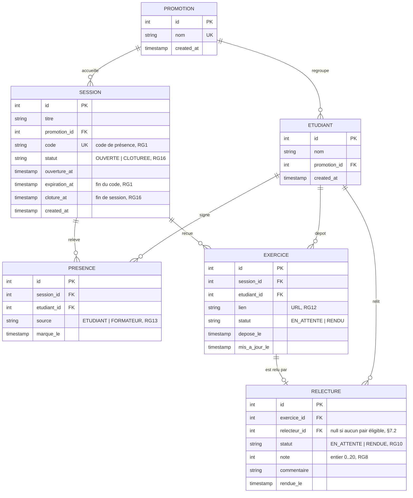

# D2 — Modèle de données

> **Ce diagramme EST le schéma des migrations Flyway.** Toute divergence entre les colonnes ci-dessous et `V1__init.sql` est un bug, pas un détail.
> Sources : `api/contrat.yaml` (colonnes et énumérations), `CLIENT.md` Q1–Q16, cahier §6.

## Correspondance 1:1 avec les migrations

| Migration | Éléments du diagramme |
|---|---|
| **`V1__init.sql`** | Les 6 tables + contraintes `UNIQUE` + `CHECK` + index |
| **`V2__seed_demo.sql`** | 1–2 promotions, ~15 étudiants, 1 session ouverte avec code réel, quelques présences et exercices |
| **`V3__*.sql`** (étape 3) | Ajouts provenant de l'évolution du besoin — **jamais** de modification en place (B5) |

## Contraintes d'intégrité (écrites dans `V1`)

| Contrainte | Règle | Source |
|---|---|---|
| `uk_presence_etudiant_session` | 1 présence par (étudiant, session) → `409 DEJA_PRESENT` | RG14 |
| `uk_exercice_etudiant_session` | 1 exercice par (étudiant, session) | logique métier |
| `uk_relecture_exercice` | **Un seul relecteur par exercice** | RG5 |
| `ck_note_entre_0_et_20` | `note IS NULL OR note BETWEEN 0 AND 20` | RG8 |
| `ck_statut_session` | `IN ('OUVERTE','CLOTUREE')` | RG16 |
| `ck_statut_relecture` | `IN ('EN_ATTENTE','RENDUE')` | RG10 |
| `ck_source_presence` | `IN ('ETUDIANT','FORMATEUR')` | RG13 |
| `idx_tableau` | `(session_id, etudiant_id)` sur `presences`, `(etudiant_id)` sur `exercices` | ENF2 |

## Points d'attention

- **Pas de table `Relecteur`** : le relecteur est un `Etudiant` référencé par `RELECTURE` (cahier §2).
- **`relecture.relecteur_id` est nullable** : cas « aucun pair présent à la session » (§7.2 du cahier) — l'exercice reste `EN_ATTENTE` et remonte dans `relecturesEnAttente` (Q11, RG10).
- **`note` est nullable** : c'est ce qui rend `moyenne = null` possible dans `GET /api/tableau` (contrat) tant qu'aucune note n'existe (RG17).
- **Deux timestamps de fin distincts** : `expiration_at` (code, Q2) ≠ `cloture_at` (session, Q3/Q12) — les confondre invaliderait RG1 et RG11.
