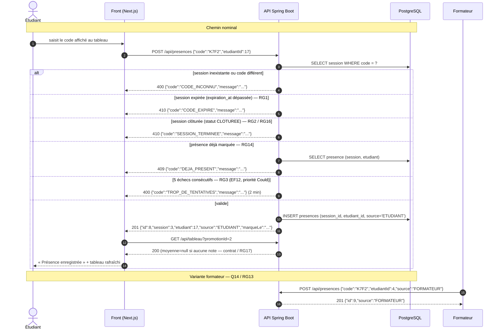

# D3 — Séquence « marquer sa présence » (≡ codes HTTP)

> Ce diagramme est **contractuel** : chaque message porte le verbe, le chemin et le code de
> `api/contrat.yaml`. S'il diverge du contrat, c'est le diagramme qui a tort.
> Sources : `api/contrat.yaml` opération `POST /api/presences`, `CLIENT.md` Q1–Q4, Q14.

## Table des codes — `POST /api/presences`

| Code | Déclencheur | Règle |
|---|---|---|
| `201` | Présence créée | — |
| `400` `CODE_INCONNU` | Code absent/incorrect | contrat |
| `400` `TROP_DE_TENTATIVES` | 5 échecs, 2 min de blocage | Q4 — *voir §7.2 du cahier : `400`, pas `429`, pour ne pas ajouter de code de statut à l'opération imposée* |
| `409` `DEJA_PRESENT` | Déjà présent dans la session | RG14 |
| `410` `CODE_EXPIRE` | `expiration_at` dépassée | RG1 / Q2 |
| `410` `SESSION_TERMINEE` | Session `CLOTUREE` | RG2 / Q3 + RG16 |

**Égalités à respecter entre ce tableau, `api/contrat.yaml` et le code** : un écart sur une seule
ligne = non-conformité `B2`. Le formattage d'erreur `{code, message}` est commun à **toutes** les
routes, y compris les 404 (`B4`).

## Erreurs non testées ici mais présentes

- `POST /api/sessions` → `400` promotion inconnue, `422` titre manquant.
- `POST /api/exercices` → `409` session clôturée, `410` code expiré, `400` URL invalide.
- `POST /api/relectures/{id}` → `403` `AUTO_RELECTURE` (Q5 / RG4), `409` `RELECTURE_DEJA_RENDUE` (Q15 / RG9).
