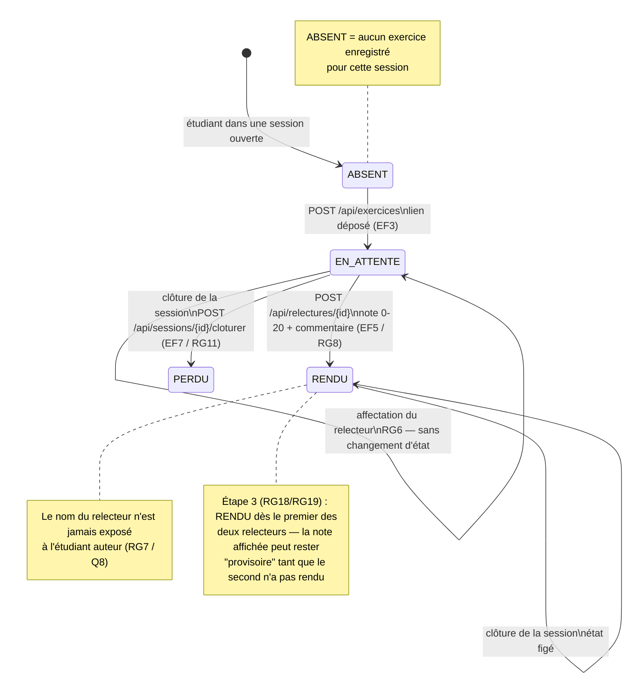

# D4 — États-transitions de l'exercice *(bonus)*

> Ce diagramme sert de **contrat de test** : chaque flèche correspond à un scénario
> d'acceptation dans le backlog (EF3, EF4, EF5, EF10, RG10, RG11, RG12).
> Sources : `api/contrat.yaml`, `CLIENT.md` Q11, Q12, Q13, Q15.

## Correspondance avec les codes HTTP

| Transition | Réponse attendue |
|---|---|
| `ABSENT → EN_ATTENTE` | `201 {id, statut:"EN_ATTENTE"}` |
| `EN_ATTENTE → EN_ATTENTE` (remplacement) | `200` ; `409` si la relecture est déjà `RENDUE` (RG12) |
| `EN_ATTENTE → RENDU` | `200` ; `400 NOTE_INVALIDE` si note hors 0–20 (RG8) ; `403 AUTO_RELECTURE` si auteur = relecteur (RG4) |
| `RENDU → RENDU` (bis) | `409 RELECTURE_DEJA_RENDUE` (RG9) |
| `→ PERDU` | `409` (session clôturée) sur tout nouveau dépôt — RG11 / Q12 |
| État non terminal inatteignable | `400`/`404` : jamais de `500` côté client (ENF3 / B4) |

## Pourquoi ce diagramme est un bonus utile

- Il rend **visible** la décision de la contradiction Q10/Q15 : la boucle `RENDU → RENDU` répondant
  `409` est l'état retenu (cahier §7.1). Si Q10 avait été choisie, cette flèche disparaîtrait au
  profit d'une transition vers la clôture.
- Il isole le **trou principal** (la clôture) dans une seule transition, vérifiable par un test.
- Il donne au test d'intégration de l'étape 2 sa liste de cas : déposer, remplacer, relire,
  se relire soi-même, double-rendu, relire après clôture.
